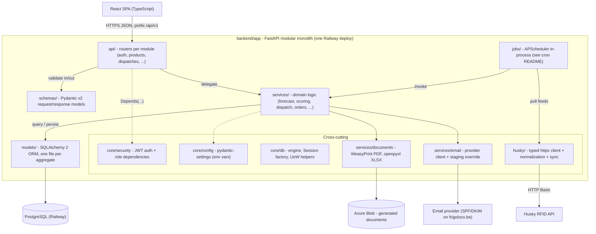
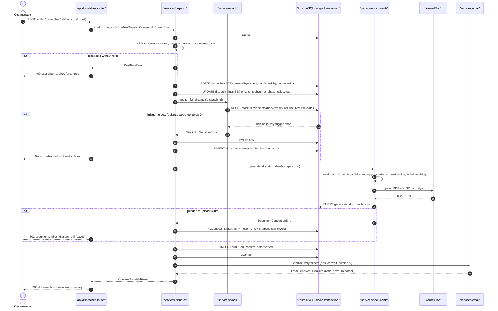
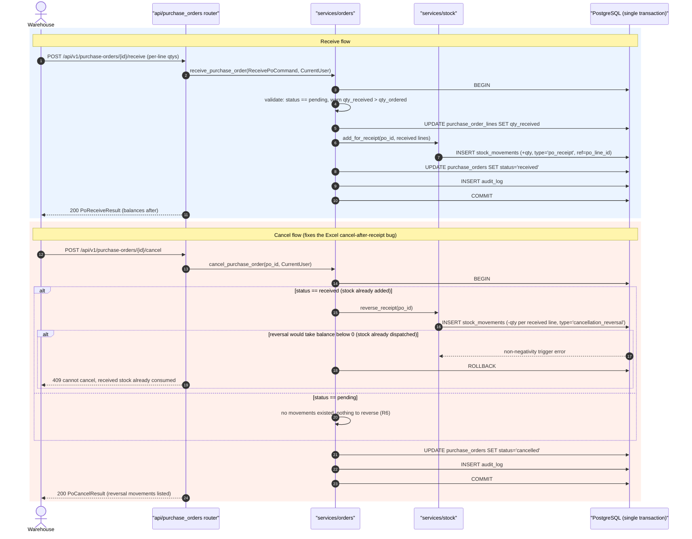
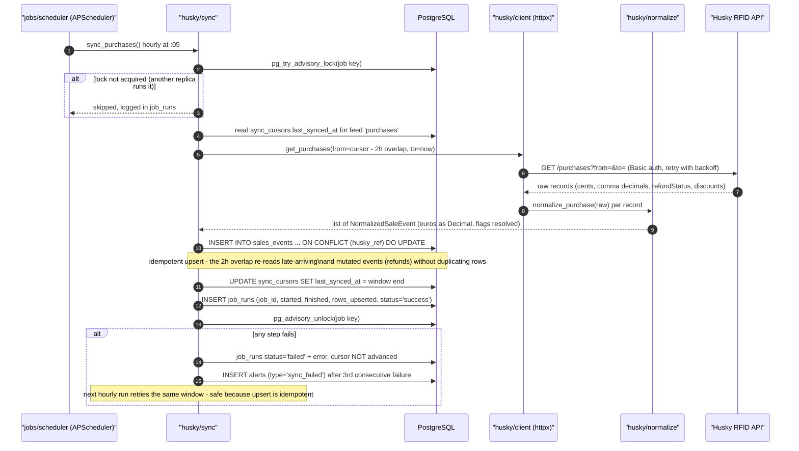

# FrigoLoco ERP - Backend Architecture

> **⚠ DRIFT NOTICE (verifier, 2026-07-03):** parts of this document predate the canonical decisions in
> [`architecture/IMPLEMENTATION-BRIEF.md`](../IMPLEMENTATION-BRIEF.md) and the scaffolded code. Where they disagree,
> the BRIEF + code win: **no Alembic** (plain SQL via `backend/scripts/apply_schema.py`), **APScheduler worker in `cron/`**
> (not in-process, not Railway cron), **`sync_run` + trailing-overlap re-pull** (no `sync_cursors` table),
> env keys `DB_URL`/`FRIGOLOCO_API_*`, models split `master/planning/operations/events/sync`.

> Layer: **BACKEND** · Stack: FastAPI (Python 3.12) · SQLAlchemy 2 + Alembic · PostgreSQL · APScheduler (in-process) · httpx · openpyxl / WeasyPrint · Azure Blob · Railway (modular monolith)
>
> Source of truth: spec [`0001-frigoloco-excel-to-cloud-erp`](../../specs/0001-frigoloco-excel-to-cloud-erp_2026-07-02_0810PM_UTC/0001-frigoloco-excel-to-cloud-erp_2026-07-02_0810PM_UTC_v1.html) - business rules **R1–R12**, API surface table, Husky sync strategy, 5-phase implementation plan. Scheduled jobs are documented separately in [`../cron/README.md`](../cron/README.md).

---

## 1. Layering

One FastAPI app, one Railway deploy, one PostgreSQL database. Strict downward dependency: routers never touch models directly; services never import routers. Cross-cutting concerns (auth, config, Husky client, documents, email) are injected, not reached into.



Rules of the road:

- **Routers** parse/authorize only. No business logic, no SQL.
- **Schemas** are the only shapes crossing the HTTP boundary. Internal service inputs/outputs are `@dataclass` or Pydantic models - never bare dicts or tuples.
- **Services** own transactions (one `Session` per request via dependency; services decide commit/rollback boundaries for multi-step flows).
- **Models** are persistence only - no domain rules in ORM classes beyond constraints/defaults.
- The **stock non-negativity trigger** lives in the database (Alembic migration 0001), not in Python - the API merely translates the trigger error into a `409`.

---

## 2. Folder tree - `backend/app/`

```
backend/
├── alembic/                     # migrations (0001 = full 27-table schema, enums, stock trigger, event partitions)
├── tests/                       # see §7 Testing strategy
└── app/
    ├── main.py                  # FastAPI app factory, router registration, scheduler startup/shutdown hooks
    ├── core/
    │   ├── config.py            # pydantic-settings Settings class - single source for every env var (§6)
    │   ├── security.py          # password hashing, JWT encode/decode, get_current_user, require_roles(...) dependency
    │   └── db.py                # SQLAlchemy engine, sessionmaker, get_session dependency, advisory-lock helpers
    ├── models/                  # SQLAlchemy 2 declarative models - one file per aggregate
    │   ├── catalogue.py         # suppliers, categories, products, fridge_product_prices, product_targets, menu_product_caps
    │   ├── clients.py           # clients, fridges, fridge_delivery_config, client_fees, client_service_charges, client_interventions
    │   ├── orders.py            # purchase_orders, purchase_order_lines, stock_movements
    │   ├── dispatch.py          # weekly_menus, menu_products, forecast_runs/results, dispatches, dispatch_lines, restock_verifications(+lines)
    │   ├── events.py            # sales_events, restock_events, product_reviews (monthly partitions), sync_cursors
    │   ├── finance.py           # weekly_financials, product_scores, fridge_product_scores
    │   └── system.py            # users, settings, alerts, audit_log, job_runs, generated_documents
    ├── schemas/                 # Pydantic v2 models mirroring the API surface, one file per router
    ├── api/                     # routers - thin: auth check, schema validation, service call
    │   ├── auth.py              # POST /auth/login, /auth/refresh, GET /auth/me
    │   ├── products.py          # CRUD /products, POST /products/sync-husky, GET/PUT /products/{id}/fridge-prices
    │   ├── suppliers.py         # CRUD /suppliers
    │   ├── categories.py        # CRUD /categories (display_order + dispatch_print_order, R8)
    │   ├── clients.py           # CRUD /clients, /clients/{id}/fees, /clients/{id}/interventions
    │   ├── fridges.py           # CRUD /fridges, /fridges/{id}/delivery-config (Husky id mapping)
    │   ├── menus.py             # GET/POST /menus?year=&week=, copy, PUT products, /product-targets, /menu-caps
    │   ├── forecasts.py         # POST /forecasts/run, GET /forecasts/latest, GET /forecasts/performance
    │   ├── dispatches.py        # CRUD, matrix, bulk lines, apply-forecast, confirm, documents, reconcile
    │   ├── purchase_orders.py   # CRUD, draft-from-dispatch, send, receive, cancel
    │   ├── stock.py             # GET /stock/balances, POST /stock/adjustments, GET /stock/movements
    │   ├── finance.py           # weekly P&L, monthly analysis, fridge GSV report
    │   ├── alerts.py            # GET /alerts, PUT /alerts/{id}/ack
    │   ├── settings.py          # GET/PUT /settings (scoring weights, margins, fees, thresholds, flags)
    │   ├── sync.py              # POST /sync/husky/{feed} - internal, admin-only; also invoked by scheduler
    │   └── health.py            # GET /health, GET /health/jobs (last-success per job, see cron README)
    ├── services/                # domain logic - see §3 Service catalogue
    │   ├── forecast.py          # R1 forecast engine (+ flagged enhancements)
    │   ├── scoring.py           # R2 product scoring, current + dual model behind flag
    │   ├── menu_allocation.py   # R3 score-proportional split + snacks/drinks target replenishment
    │   ├── dispatch.py          # R7 batch lifecycle, confirm transaction orchestration
    │   ├── orders.py            # R4/R5 PO lifecycle: numbering, VAT totals, receive, cancel+reversal
    │   ├── stock.py             # R6 ledger writes, balances (in-stock vs on-order), adjustments
    │   ├── reconciliation.py    # R9 dispatched vs RFID ADDED diff
    │   ├── finance.py           # R10/R11/R12 weekly P&L, bucketing/proration, fixed-cost allocation
    │   ├── documents.py         # PO / dispatch-sheet / GSV rendering (WeasyPrint PDF, openpyxl XLSX) + Blob upload
    │   └── email.py             # outbound mail, STAGING_EMAIL_OVERRIDE, digest assembly
    ├── husky/
    │   ├── client.py            # typed httpx client for the 5 endpoints, Basic auth, retry/backoff, pagination
    │   ├── normalize.py         # cents→Decimal euros, comma-decimal strings, tag_status mapping, fridge-name→id join
    │   └── sync.py              # incremental feed sync (cursor + overlap + idempotent upsert), one-time backfill
    └── jobs/
        ├── scheduler.py         # APScheduler setup, Postgres advisory-lock wrapper, job_runs logging, retries
        └── definitions.py       # the 14 job registrations (id, cron, callable) - catalogue in ../cron/README.md
```

---

## 3. Service catalogue

Conventions used below: every structured parameter/return is a `@dataclass` (internal) or Pydantic model (crosses the HTTP boundary). `Session` is the SQLAlchemy session injected per request; `CurrentUser` is the dataclass produced by `core/security`. Money is `Decimal` everywhere internally.

### 3.1 `services/forecast.py` - implements **R1** (+ Phase-5 flags)

Per fridge × category: 3-week sales window anchored on the fridge's delivery weekday, holiday filter via `min_daily_qty`, no-data days count in the denominator, per-category tunable margin %. Reads **local** `sales_events` - never Husky live.

```python
@dataclass(frozen=True)
class ForecastRunParams:
    delivery_date: date
    fridge_ids: list[int] | None = None          # None = all active fridges
    window_weeks: int = 3                        # 6–12 months behind RESIDUAL/window flags
    triggered_by: ForecastTrigger = ForecastTrigger.MANUAL   # MANUAL | SCHEDULED

@dataclass(frozen=True)
class ForecastCellResult:
    fridge_id: int
    category_id: int
    forecast_qty: int
    valid_days: int
    holiday_days: int
    no_info_days: int
    margin_pct: Decimal

@dataclass(frozen=True)
class ForecastRunResult:
    run_id: int
    delivery_date: date
    cells: list[ForecastCellResult]

def run_forecast(params: ForecastRunParams, user: CurrentUser, session: Session) -> ForecastRunResult
def get_latest_forecast(delivery_date: date, session: Session) -> ForecastRunResult | None
def get_forecast_performance(year: int, iso_week: int, session: Session) -> list[FridgeForecastPerformance]
    # FridgeForecastPerformance: fridge_id, added_qty, sold_qty, sell_through_pct (>=90% / <70% UI coding)
```

Persists `forecast_runs` (params as JSONB snapshot - window, weights, margins at run time) + `forecast_results`.

### 3.2 `services/scoring.py` - implements **R2**

Trailing-365-day score: `%sold×w1 + reviewScore×w2 + margin×w3`, weights from `settings` (currently 0.62/0.05/0.33). `%sold = sold ÷ added` excluding `UNRECOGNISED` tags; `reviewScore = (pos − neg) ÷ (pos + neg)` with `rating == 1` positive; `margin = (salePriceExVat − buyPrice) ÷ salePriceExVat`. Behind `DUAL_SCORING`: 50/50 global × per-fridge model, ≤ 250 lifetime sales → average global score baseline.

```python
@dataclass(frozen=True)
class ScoringWeights:
    pct_sold: Decimal
    review: Decimal
    margin: Decimal

@dataclass(frozen=True)
class ProductScoreInputs:
    product_id: int
    sold_qty: int
    added_qty: int              # excl. UNRECOGNISED
    positive_reviews: int
    negative_reviews: int
    sale_price_ex_vat: Decimal
    buy_price: Decimal
    lifetime_sales: int

@dataclass(frozen=True)
class ScoringRunSummary:
    period_end: date
    products_scored: int
    fridge_scores_written: int   # 0 when DUAL_SCORING off
    baseline_applied: int        # products that got the <=250-sales average baseline

def recompute_product_scores(as_of: date, session: Session) -> ScoringRunSummary   # nightly job entry point
def compute_global_score(inputs: ProductScoreInputs, weights: ScoringWeights) -> Decimal
def compute_fridge_score(inputs: FridgeScoreInputs, weights: FridgeScoringWeights) -> Decimal  # DUAL_SCORING path
```

### 3.3 `services/menu_allocation.py` - implements **R3**

Score-proportional split of a fridge's category forecast across menu products, descending by score, with rounding guards (allocation < 0.5 bumped to 0.51 when remainder > 0.5; leftovers to top-scored product). Snacks & Drinks bypass allocation: `to_restock = target − live RFID stock` per fridge × product. Respects `menu_product_caps`.

```python
@dataclass(frozen=True)
class MenuAllocationRequest:
    fridge_id: int
    category_id: int
    forecast_qty: int
    menu_id: int

@dataclass(frozen=True)
class AllocationLine:
    fridge_id: int
    product_id: int
    qty: int
    source: AllocationSource     # FORECAST | TARGET_REPLENISH

def allocate_category_forecast(request: MenuAllocationRequest, session: Session) -> list[AllocationLine]
def compute_target_replenishment(fridge_id: int, snapshot: LiveStockSnapshot, session: Session) -> list[AllocationLine]
```

### 3.4 `services/dispatch.py` - implements **R7** (and orchestrates R8 via documents)

Batch identity = (ISO week, weekday, week start date); `UNIQUE(delivery_date)` in `dispatches`. Saving replaces prior lines for the key (optionally one category). Confirm is a single transaction - see §4a.

```python
@dataclass(frozen=True)
class DispatchLineInput:
    fridge_id: int
    product_id: int
    qty: int
    source: DispatchLineSource   # FORECAST | MANUAL

@dataclass(frozen=True)
class DispatchSaveResult:
    dispatch_id: int
    lines_written: int
    lines_replaced: int
    validation_errors: list[CellValidationError]   # per-cell: menu membership, caps, stock - 409 payload

@dataclass(frozen=True)
class ConfirmDispatchCommand:
    dispatch_id: int
    force_past_date: bool = False

@dataclass(frozen=True)
class ConfirmDispatchResult:
    dispatch_id: int
    movements_created: int
    documents: list[GeneratedDocumentRef]          # blob URL + fridge per sheet
    emails_queued: int

def save_dispatch_lines(dispatch_id: int, lines: list[DispatchLineInput], category_id: int | None,
                        user: CurrentUser, session: Session) -> DispatchSaveResult
def apply_forecast(dispatch_id: int, user: CurrentUser, session: Session) -> DispatchSaveResult
def confirm_dispatch(command: ConfirmDispatchCommand, user: CurrentUser, session: Session) -> ConfirmDispatchResult
def get_dispatch_matrix(dispatch_id: int, session: Session) -> DispatchMatrix   # fridges × products grouped by category
```

### 3.5 `services/orders.py` - implements **R4, R5**

Order numbering `YYYY-NNNNN` from a per-year DB sequence (concurrency-safe). Dates cannot be past. `lineTotal = price × qty × (1+vat)`; totals accumulate ex-VAT / VAT / incl-VAT separately (VAT as fraction, e.g. `0.06`).

```python
@dataclass(frozen=True)
class PurchaseOrderDraft:
    supplier_id: int
    order_date: date
    expected_delivery_date: date
    delivery_address: str
    comment: str
    lines: list[PoLineDraft]     # PoLineDraft: product_id, qty, unit_price, vat_rate

@dataclass(frozen=True)
class ReceivePoCommand:
    po_id: int
    received: list[PoLineReceipt]   # PoLineReceipt: po_line_id, qty_received
    acknowledge_over_receipt: bool = False   # required when qty_received > qty_ordered

@dataclass(frozen=True)
class PoCancelResult:
    po_id: int
    previous_status: PoStatus
    reversal_movements: list[int]   # stock_movements ids, empty when cancelled while pending

def create_purchase_order(draft: PurchaseOrderDraft, user: CurrentUser, session: Session) -> PurchaseOrderRead
def draft_from_dispatch(dispatch_id: int, session: Session) -> list[PurchaseOrderDraft]   # aggregate per supplier, zero-qty excluded
def send_purchase_order(po_id: int, user: CurrentUser, session: Session) -> PoSendResult  # document + blob + email
def receive_purchase_order(command: ReceivePoCommand, user: CurrentUser, session: Session) -> PoReceiveResult
def cancel_purchase_order(po_id: int, user: CurrentUser, session: Session) -> PoCancelResult
```

### 3.6 `services/stock.py` - implements **R6**

Append-only `stock_movements` ledger; physical balance = SUM over movements, **non-negativity enforced by DB trigger**. On-order column is the R6 projection from pending PO lines (not movements). Adjustments require a reason (422 without).

```python
@dataclass(frozen=True)
class StockBalance:
    product_id: int
    in_stock: int          # SUM(stock_movements.qty)
    on_order: int          # SUM(pending PO qty_ordered)

@dataclass(frozen=True)
class StockAdjustmentInput:
    product_id: int
    qty: int               # signed
    reason: str            # mandatory

def get_stock_balances(filters: StockBalanceFilters, session: Session) -> Page[StockBalance]
def record_adjustment(adjustment: StockAdjustmentInput, user: CurrentUser, session: Session) -> StockMovementRead
def deduct_for_dispatch(dispatch_id: int, user: CurrentUser, session: Session) -> list[StockMovementRead]   # raises StockNonNegativeError
def add_for_receipt(po_id: int, received: list[PoLineReceipt], user: CurrentUser, session: Session) -> list[StockMovementRead]
def reverse_receipt(po_id: int, user: CurrentUser, session: Session) -> list[StockMovementRead]             # cancellation_reversal rows
def get_movements(product_id: int, page: PageParams, session: Session) -> Page[StockMovementRead]
```

`StockNonNegativeError` (raised when the trigger rejects) carries the offending `product_id`s and is mapped to **409** with an `alerts` row (`negative_blocked`).

### 3.7 `services/reconciliation.py` - implements **R9**

Per dispatch (week, day): diff RFID `ADDED` events vs dispatched lines, per product × fridge and per category, in qty and € at buy price. `UNRELIABLE` tags counted separately and excluded from totals; `UNRECOGNISED` excluded entirely.

```python
@dataclass(frozen=True)
class ReconciliationLine:
    fridge_id: int
    product_id: int
    dispatched_qty: int
    added_qty: int
    unreliable_qty: int
    diff_qty: int
    diff_value: Decimal      # at unit_purchase_price snapshot

@dataclass(frozen=True)
class ReconciliationReport:
    dispatch_id: int
    run_at: datetime
    lines: list[ReconciliationLine]
    category_totals: list[CategoryReconTotal]

def reconcile_dispatch(dispatch_id: int, user: CurrentUser, session: Session) -> ReconciliationReport
    # persists restock_verifications(+lines), flips dispatch status to 'reconciled', queues email digest
```

### 3.8 `services/finance.py` - implements **R10, R11, R12**

`net revenue = gross sales + customer credit − refunds`; FrigoLoco-provider discounts separate from customer credit; fees = POS 9% of sales + €0.10 RFID per item sold (both snapshotted per week from `settings`). Monday-anchored weeks (week 1 = Monday nearest Jan 1, Fri–Sun starts shift forward); straddling weeks prorated by `days-in-month ÷ 7`. Fixed costs spread via client fees, computed fridge-month fractions, and service additionals.

```python
@dataclass(frozen=True)
class WeeklyFinancialInputs:      # the manual entries, R10
    year: int
    iso_week: int
    catering_turnover: Decimal
    catering_food_cost: Decimal
    tgtg_turnover: Decimal
    logistics_cost: Decimal
    drops_count: int
    unsold_items: int
    remarks: str

@dataclass(frozen=True)
class WeeklyPnl:
    inputs: WeeklyFinancialInputs
    gross_sales: Decimal
    refunds: Decimal
    customer_credit: Decimal
    frigoloco_discounts: Decimal
    net_revenue: Decimal
    pos_fee: Decimal
    rfid_fee: Decimal

def get_weekly_pnl(year: int, iso_week: int, session: Session) -> WeeklyPnl
def upsert_weekly_inputs(inputs: WeeklyFinancialInputs, user: CurrentUser, session: Session) -> WeeklyPnl
def get_monthly_analysis(month: date, dimension: AnalysisDimension, session: Session) -> MonthlyAnalysis
    # AnalysisDimension: CLIENT | SUPPLIER | CATEGORY - computed live from events, no stored aggregate tables
def get_fridge_gsv_report(request: GsvReportRequest, session: Session) -> GsvReport
    # GsvReportRequest: fridge_id, date_from, date_to → added qty, food cost, revenue, margin
def resolve_week_bucket(day: date) -> WeekBucket                      # R11, shared with jobs
def prorate_week_to_months(week: WeekBucket, amount: Decimal) -> list[MonthShare]   # R11
```

### 3.9 `services/documents.py` - implements **R8** (rendering half)

Reproduces the three Excel templates: PO document (PDF via WeasyPrint + XLSX via openpyxl), per-fridge delivery sheets (fixed category print order Hot → Frozen → Salads → Wraps → Granolas → Soups → Desserts → Drinks → Snacks; In-box/Missing columns; withdrawal list for short-DLC products from the latest live-stock snapshot), GSV XLSX export. Uploads to Azure Blob, records `generated_documents` rows so files are re-downloadable.

```python
@dataclass(frozen=True)
class GeneratedDocumentRef:
    document_id: int
    kind: DocumentKind           # PO_PDF | PO_XLSX | DISPATCH_SHEET_PDF | DISPATCH_SHEET_XLSX | GSV_XLSX
    fridge_id: int | None
    blob_url: str

def generate_po_document(po_id: int, formats: list[DocumentFormat], session: Session) -> list[GeneratedDocumentRef]
def generate_dispatch_sheets(dispatch_id: int, session: Session) -> list[GeneratedDocumentRef]   # one per fridge
def generate_gsv_export(request: GsvReportRequest, session: Session) -> GeneratedDocumentRef
```

Raises `DocumentGenerationError` - inside the confirm-dispatch transaction this triggers full rollback (§4a).

### 3.10 `services/email.py`

Single outbound gateway. In staging, `STAGING_EMAIL_OVERRIDE` redirects every message to the override address (port of today's `OrderSheetIsTestRun`). Never called inside an open transaction - always post-commit.

```python
@dataclass(frozen=True)
class OutboundEmail:
    to: list[str]
    subject: str
    html_body: str
    attachments: list[EmailAttachment]   # EmailAttachment: filename, blob_url or bytes

@dataclass(frozen=True)
class EmailSendResult:
    accepted: bool
    provider_message_id: str | None
    error: str | None

def send_email(message: OutboundEmail) -> EmailSendResult
def send_alert_digest(day: date, session: Session) -> EmailSendResult   # used by alert_email_digest job
```

### 3.11 `husky/` - client, normalize, sync

```python
# husky/client.py - typed httpx client, HTTP Basic, retry with exponential backoff, rate-limit aware
def get_product_types() -> list[RawProductType]
def get_purchases(window: DateWindow) -> list[RawPurchase]
def get_restock_events(window: DateWindow, action: RestockAction | None) -> list[RawRestockEvent]
def get_product_reviews(window: DateWindow) -> list[RawProductReview]
def get_current_stock() -> list[RawStockLine]        # pass-through snapshot, never persisted long-term

# husky/normalize.py - one normalization point for every API quirk
def normalize_price_cents(value: int) -> Decimal                     # 595 -> Decimal('5.95')
def normalize_comma_decimal(value: str) -> Decimal                   # '4,20' -> Decimal('4.20')
def normalize_tag_status(raw: str) -> TagStatus                      # VALID | UNRELIABLE | UNRECOGNISED
def resolve_fridge_id(friendly_name: str | None, husky_name: str | None, session: Session) -> int
    # maps BOTH friendlyName and fridge.name to the internal fridge id (join-key inconsistency fix)
def normalize_purchase(raw: RawPurchase, session: Session) -> NormalizedSaleEvent
def normalize_restock(raw: RawRestockEvent, session: Session) -> NormalizedRestockEvent

# husky/sync.py - incremental feeds + backfill (see §4c and ../cron/README.md)
def sync_feed(feed: HuskyFeed, session: Session) -> SyncRunResult    # HuskyFeed: PURCHASES | RESTOCK | CATALOGUE | REVIEWS | STOCK_SNAPSHOT
def run_backfill(plan: BackfillPlan, session: Session) -> BackfillResult   # monthly chunks + checkpointing
    # SyncRunResult: feed, window, rows_fetched, rows_upserted, cursor_advanced_to
```

### Business-rule ownership map

| Rule | Service | Rule | Service |
|---|---|---|---|
| R1 forecast | `forecast.py` | R7 dispatch batch identity | `dispatch.py` |
| R2 scoring | `scoring.py` | R8 delivery sheet layout | `documents.py` (order/layout) + `dispatch.py` (trigger) |
| R3 menu allocation | `menu_allocation.py` | R9 reconciliation | `reconciliation.py` |
| R4 order numbering/dates | `orders.py` | R10 weekly P&L | `finance.py` |
| R5 VAT math | `orders.py` | R11 week/month bucketing | `finance.py` (shared helpers) |
| R6 stock projection | `stock.py` | R12 fixed-cost allocation | `finance.py` |

---

## 4. Critical transactional flows

### 4a. Confirm dispatch - one transaction, all-or-nothing

Everything up to and including the `generated_documents` rows is one DB transaction. A failure at any step (including document rendering or Blob upload) rolls back the status flip, the stock movements, and the price snapshots - the dispatch stays `saved` and can be re-confirmed. Email is deliberately **outside** the transaction: a bounced email must never un-dispatch stock; it produces an alert instead.



Rollback semantics summary:

| Failure point | Effect |
|---|---|
| Past date without `force` | 409, nothing written |
| Stock trigger rejects a line | Full rollback, `negative_blocked` alert in a separate transaction, 409 with per-line detail |
| Document render / Blob upload fails | Full rollback (dispatch remains `saved`, stock untouched), 502 |
| Email fails | **No rollback** - dispatch is confirmed; `alerts` row + retry via digest |
| Re-confirm after success | Idempotent: status already `dispatched` → 200 with existing documents, no new movements |

Orphaned blobs from a rolled-back upload are tolerated (private container, overwritten on retry since blob names are deterministic: `dispatches/{delivery_date}/{fridge_husky_id}.pdf`).

### 4b. PO receive / cancel - explicit stock reversal

Cancellation after receipt inserts explicit `cancellation_reversal` movements instead of silently recomputing - this is the fix for the named Excel bug (R6). The reversal itself goes through the same non-negativity trigger: if the received stock has already been dispatched, the cancel is refused.



Notes:

- Over-receipt (`qty_received > qty_ordered`) is a **warning**, not a block (manual-verification edge case in the spec); the API requires `acknowledge_over_receipt=true` to proceed.
- Cancelling a **pending** PO writes no movements at all - pending quantities only ever existed in the on-order projection (R6), never in the ledger.
- Partial receipt keeps the PO `pending` until all lines have a `qty_received` recorded (design decision, see §8 in the completion notes).

### 4c. Husky incremental sync - idempotent upsert

Feed cursors live in `sync_cursors` (one row per feed). Each run re-reads a 2-hour overlap before the cursor so late-arriving events and mutated records (refund status changes on purchases) are re-upserted. Idempotency key = `husky_ref` unique constraint; the upsert is `INSERT ... ON CONFLICT (husky_ref) DO UPDATE`, so re-running any window is always safe.



The cursor only advances after a fully successful upsert, so a mid-run crash re-processes the whole window on the next tick - duplicates are impossible by construction. Divergence that slips past this is caught by the `daily_husky_reconciliation` job (see `../cron/README.md`).

---

## 5. API conventions

### Versioning and shape

- All routes under **`/api/v1`**. Breaking changes mean `/api/v2` - additive changes (new optional fields) do not.
- Request/response bodies are Pydantic v2 models only. No anonymous dict payloads.
- **Money serializes as decimal strings** (`"5.95"`, never floats) in every response; parsed back to `Decimal` on input. Internal computation is `Decimal` end-to-end; `NUMERIC(10,2)` in the DB.
- Timestamps are UTC ISO-8601 with offset; dates are `YYYY-MM-DD`. Operational schedules (delivery days, job crons) are interpreted in `Europe/Brussels`.

### Role-based access matrix

`core/security.require_roles(...)` is applied per router (with per-endpoint overrides where a router mixes read/write audiences). Roles from the `users.role` enum; `admin` implicitly passes every check.

| Router | admin | ops_manager | warehouse | driver | finance |
|---|---|---|---|---|---|
| auth (`/auth/*`) | ✔ | ✔ | ✔ | ✔ | ✔ |
| products / suppliers / categories | ✔ | ✔ | read | - | read |
| clients / fridges | ✔ | ✔ | read | - | read |
| menus (+ targets, caps) | ✔ | ✔ | read | - | - |
| forecasts | ✔ | ✔ | read | - | - |
| dispatches (save, confirm, reconcile) | ✔ | ✔ | read | read (own day's sheets) | - |
| purchase_orders (create, send, receive, cancel) | ✔ | ✔ | ✔ | - | read |
| stock (balances, adjustments, movements) | ✔ | ✔ | ✔ | - | read |
| finance | ✔ | read | - | - | ✔ |
| alerts | ✔ | ✔ | ✔ | - | read |
| settings | ✔ | ✔ (no user mgmt) | - | - | - |
| users CRUD | ✔ | - | - | - | - |
| sync (`/sync/husky/*`), `/health/jobs` | ✔ | - | - | - | - |

A wrong role always yields **403** with the standard error body. The integration test suite asserts this matrix row by row (spec acceptance criterion).

### Error model

Single envelope for all non-2xx responses:

```json
{
  "error": {
    "code": "stock_blocked",
    "message": "Confirming would take 2 products below zero stock",
    "details": [ { "product_id": 118, "requested": 40, "available": 31 } ]
  }
}
```

| Status | When | `code` examples |
|---|---|---|
| 400 | Malformed request outside schema validation | `bad_request` |
| 401 | Missing/expired/invalid JWT | `unauthenticated` |
| 403 | Role not allowed | `forbidden` |
| 404 | Entity not found | `not_found` |
| **409** | Business-rule conflict: **stock-blocked** (trigger), past-date dispatch without `force`, cancel of consumed receipt, duplicate delivery-date dispatch, order-no collision retry exhausted | `stock_blocked`, `past_date_requires_force`, `cancel_blocked`, `conflict` |
| **422** | Pydantic validation: missing adjustment reason, negative qty, past order date (R4), unknown enum | FastAPI validation detail wrapped in the envelope |
| 502 | Downstream failure surfaced to caller (document generation, Husky pass-through on `/stock/current`) | `document_generation_failed`, `husky_unavailable` |

Every 409 of type `stock_blocked` also writes an `alerts` row (`negative_blocked`) - visible in the Alerts inbox.

### Pagination

List endpoints accept `?limit=` (default 50, max 500) and `?offset=`, and return the envelope:

```json
{ "items": [ ... ], "total": 1234, "limit": 50, "offset": 0 }
```

High-volume event/movement endpoints (`/stock/movements`, reconciliation raw lines) additionally support keyset pagination via `?after_id=` for stable deep scrolling; the matrix and balances endpoints are unpaginated by design (bounded by fridges × products, virtualized client-side).

---

## 6. Configuration - environment variables

All settings load once through `core/config.Settings` (pydantic-settings); nothing reads `os.environ` directly. Missing required vars fail startup loudly.

| Variable | Required | Purpose | Notes |
|---|---|---|---|
| `DATABASE_URL` | ✔ | PostgreSQL DSN (Railway-injected) | `postgresql+psycopg://...` |
| `HUSKY_BASE_URL` | ✔ | Husky API root | `https://api.intelligentfridges.com/api/v1/frigoloco` |
| `HUSKY_USER` | ✔ | HTTP Basic user | Dedicated backend account - never the personal creds from the old scripts (rotated at cutover) |
| `HUSKY_PASSWORD` | ✔ | HTTP Basic password | |
| `JWT_SECRET` | ✔ | HS256 signing key for access/refresh tokens | Rotate = force re-login |
| `JWT_ACCESS_TTL_MINUTES` | - | Access-token lifetime (default 30) | |
| `AZURE_BLOB_CONN` | ✔ | Azure Blob connection string | Container `documents`, private access |
| `EMAIL_PROVIDER` | ✔ | `smtp` or provider name (open question Q1 in spec) | |
| `EMAIL_HOST` / `EMAIL_PORT` / `EMAIL_USER` / `EMAIL_PASSWORD` | ✔* | SMTP credentials (*when provider = smtp) | |
| `EMAIL_FROM` | ✔ | Sender identity | `@frigoloco.be`, SPF/DKIM configured pre-Phase-2 |
| `STAGING_EMAIL_OVERRIDE` | - | When set, **every** outbound email goes to this address instead of real recipients | Port of `OrderSheetIsTestRun`; set in staging, empty in production |
| `DUAL_SCORING` | - | Feature flag: dual 50/50 global × per-fridge scoring model (R2 target model) | Default `false` - parity-first cutover |
| `RESIDUAL_STOCK_FORECAST` | - | Feature flag: residual-stock deduction using live DLC in the forecast (Phase 5.4) | Default `false` |
| `SCHEDULER_ENABLED` | - | Default `true`; set `false` on any extra replica or in tests | Escape hatch for the web-vs-worker split (spec Decision 4) |
| `APP_ENV` | - | `local` / `staging` / `production` - log level, docs exposure | |
| `SENTRY_DSN` | - | Error reporting (optional) | |

Feature-flag precedence: env var is the master switch; per-tenant tunables (scoring weights, margins, thresholds, POS %, RFID fee) live in the `settings` table and are editable at runtime via `/api/v1/settings`. Env flags gate *code paths*; `settings` rows tune *parameters*.

---

## 7. Testing strategy

Mirrors the spec's Testing & Verification section; parity fixtures are the cutover gatekeepers.

| Suite | Location | What it proves |
|---|---|---|
| **Parity (golden-file)** | `backend/tests/parity/` | Each ported engine reproduces the frozen Excel fixtures within tolerance: forecast block for one delivery date (R1), product scores (R2 - e.g. Salade Cesar C&G `0.6883 ± 0.001`), PO totals for order `2026-00360` (`239.36 / 14.36 / 253.72`, R4/R5), reconciliation category totals row-for-row (R9), one weekly P&L row within €0.01 (R10), one month of supplier analysis (R11/R12), GSV for `if-0000271` June 2026. A module's Excel-retirement gate requires its parity suite green. |
| **Unit** | `backend/tests/unit/` | Pure-function coverage: order-no sequencing incl. year rollover + concurrent creation, VAT math, allocation rounding guards (0.51 bump, leftover-to-top-score), week/month bucketing + proration, Husky normalization (cents, comma decimals, tag statuses), stock trigger behavior. |
| **Integration** | `backend/tests/integration/` | Real Postgres (dockerized): confirm-dispatch atomicity (injected document failure → full rollback), PO receive/cancel movement pairs, sync idempotency (double backfill → identical row counts), trigger-level negative-stock rejection. |
| **Role suite** | `backend/tests/integration/test_roles.py` | The §5 access matrix, asserted per router × role (finance write to stock → 403, etc.). |
| **Document golden files** | `backend/tests/parity/documents/` | Rendered PO PDF/XLSX and one dispatch sheet vs the template layouts (structural comparison, not pixel). |

Fixtures come from the frozen workbook snapshots in `migration/fixtures/` (Manual Step 4). Husky client tests run against recorded httpx fixture responses - no live API in CI. E2E (Playwright) lives with the frontend and is out of scope here.
