# FrigoLoco ERP - Scheduled Jobs (Cron Layer)

> **⚠ DRIFT NOTICE (verifier, 2026-07-03):** parts of this document predate the canonical decisions in
> [`architecture/IMPLEMENTATION-BRIEF.md`](../IMPLEMENTATION-BRIEF.md) and the scaffolded code. Where they disagree,
> the BRIEF + code win: **no Alembic** (plain SQL via `backend/scripts/apply_schema.py`), **APScheduler worker in `cron/`**
> (not in-process, not Railway cron), **`sync_run` + trailing-overlap re-pull** (no `sync_cursors` table),
> env keys `DB_URL`/`FRIGOLOCO_API_*`, models split `master/planning/operations/events/sync`.

> Layer: **CRON / JOBS** · APScheduler running **in-process** inside the FastAPI web service (modular-monolith Decision 4 in the spec) · single-run guarantee via PostgreSQL advisory locks · all runs logged to `job_runs`.
>
> Code home: `backend/app/jobs/` (`scheduler.py` = engine + locking + retry + logging, `definitions.py` = the job registrations below). Companion document: [`../backend/README.md`](../backend/README.md). Source of truth: spec `0001-frigoloco-excel-to-cloud-erp` (Husky sync strategy, R1/R2, Phase 5 automation).
>
> All cron expressions are evaluated in **`Europe/Brussels`** - delivery days, alert mornings, and the ops team's clock are Belgian; UTC crons would drift an hour twice a year.

---

## 1. Job catalogue

| Job id | Schedule (cron) | What it does | Reads → Writes | Idempotency mechanism | Failure behavior / alerting |
|---|---|---|---|---|---|
| `husky_sync_purchases` | `5 * * * *` (hourly @ :05) | Incremental pull of `GET /purchases` since the feed cursor (minus 2 h overlap); normalizes cents/refunds/discounts | Husky API, `sync_cursors` → `sales_events`, `sync_cursors`, `job_runs` | Upsert `ON CONFLICT (husky_ref) DO UPDATE`; cursor advances only after successful commit | Retry ×3 exp. backoff within the run; cursor not advanced on failure so next hour replays the window; `sync_failed` alert after 3 consecutive failed runs |
| `husky_sync_restock` | `10 * * * *` (hourly @ :10) | Incremental pull of `GET /restock` (ADDED + REMOVED); maps tag status (`UNRELIABLE`/`UNRECOGNISED`) | Husky API, `sync_cursors` → `restock_events`, `sync_cursors`, `job_runs` | Same as purchases (upsert on `husky_ref` + cursor) | Same as purchases |
| `husky_stock_snapshot` | `*/15 * * * *` | Pulls `GET /stock/current`; refreshes the in-memory/table snapshot used by snacks-drinks targets (R3), below-target alerts, and the withdrawal list | Husky API → `live_stock_snapshot` (replace-all), `job_runs` | Full replace of the snapshot table in one transaction - re-run is harmless by definition | Silent single failure (next tick is 15 min away); alert only if snapshot is stale > 2 h (checked by the same job); staleness also surfaces on `/health/jobs` |
| `husky_catalogue_sync` | `0 2 * * *` (nightly 02:00) | Syncs `GET /producttype`: new products inserted (inactive until reviewed), price/VAT/expiry changes updated, "Box n°" test lines excluded | Husky API → `products` (upsert on `code`), `job_runs` | Upsert keyed on product `code`; no deletes - delisted products flagged `is_active=false` | Retry ×3; on final failure `sync_failed` alert - scoring still runs on yesterday's catalogue |
| `husky_reviews_sync` | `15 2 * * *` (nightly 02:15) | Incremental pull of `GET /productreview` (`rating == 1` positive, else negative) | Husky API, `sync_cursors` → `product_reviews`, `job_runs` | Upsert on Husky review reference + cursor | Retry ×3; failure alert; scoring proceeds with existing reviews |
| `recompute_product_scores` | `30 2 * * *` (nightly 02:30) | **R2**: trailing-365-day global scores (+ per-fridge scores when `DUAL_SCORING` on); ≤ 250-lifetime-sales baseline | `sales_events`, `restock_events`, `product_reviews`, `products`, `settings` → `product_scores`, `fridge_product_scores`, `job_runs` | Deterministic recompute keyed on `(product_id, period_end)` - re-run overwrites the same rows | Retry ×3; on failure yesterday's scores remain in force (menus/allocation degrade gracefully); `job_failed` alert |
| `auto_forecast` | Per `fridge_delivery_config` - e.g. `0 15 * * WED` for Thursday deliveries (one APScheduler trigger per configured weekday/hour pair) | **R1**: runs the forecast for the next delivery date and pre-creates a **draft** dispatch with forecast-sourced lines (Phase 5.1) | `sales_events`, `fridge_delivery_config`, `settings` → `forecast_runs`, `forecast_results`, `dispatches` (draft), `dispatch_lines`, `job_runs` | `UNIQUE(delivery_date)` on `dispatches`: if a draft already exists, lines are refreshed only where `source='forecast'` - manual edits are never overwritten | Retry ×3; on failure `job_failed` alert **and** ops can always run the forecast manually from the UI (`POST /forecasts/run`) - the job is a convenience, not a gate |
| `below_target_alerts` | `0 6 * * *` (daily 06:00) | Compares latest live-stock snapshot vs `product_targets` per fridge × product; alerts on shortfalls | `live_stock_snapshot`, `product_targets` → `alerts(below_target)`, `job_runs` | Alert dedup key `(type, fridge_id, product_id, date)` - re-run inserts nothing new | Retry ×3; failure alert; skipped when snapshot stale > 2 h (better no alert than a false one) |
| `expiry_alerts` | `10 6 * * *` (daily 06:10) | Flags tags in fridges with expiry ≤ threshold (default 2 days, from `settings`) | `live_stock_snapshot` (per-tag expiry), `settings` → `alerts(expiry)`, `job_runs` | Same date-scoped dedup key | Same as below_target |
| `low_stock_alerts` | `20 6 * * *` (daily 06:20) | Warehouse balances vs per-product thresholds | `stock_movements` (balances view), `settings` → `alerts(low_stock)`, `job_runs` | Same date-scoped dedup key | Retry ×3; failure alert |
| `rfid_offline_detector` | `30 * * * *` (hourly @ :30) | Active fridge with **zero** sales events for N hours (threshold in `settings`, business-hours aware) → probable RFID/network outage (Phase 5.2) | `sales_events`, `fridges` → `alerts(rfid_offline)`, `job_runs` | Open-alert check: no new alert while an unacked `rfid_offline` alert exists for the fridge | Retry ×3; failure alert |
| `alert_email_digest` | `0 7 * * *` (daily 07:00) | Emails ops one digest of the last 24 h of alerts (replaces the remaining PA email flows) | `alerts` → email out, `alerts.digested_at`, `job_runs` | Only alerts with `digested_at IS NULL` are included and stamped in the same tx as the successful send | Retry ×3; on final failure alerts stay undigested and roll into tomorrow's digest; `job_failed` alert (visible in inbox even if email is down) |
| `partition_maintenance` | `0 1 1 * *` (monthly, 1st @ 01:00) | Creates next month's partitions for `sales_events` / `restock_events` (+ safety: also the month after) | `pg_catalog` → DDL `CREATE TABLE ... PARTITION OF`, `job_runs` | `CREATE TABLE IF NOT EXISTS` - re-run is a no-op | Retry ×3; failure = **high-severity** alert (a missing partition would break hourly syncs at month rollover); double-ahead creation gives a 1-month buffer |
| `daily_husky_reconciliation` | `0 3 * * *` (daily 03:00) | Counts yesterday's purchase + restock events in the API (per fridge) vs local tables; divergence beyond tolerance (0.1%, from `settings`) raises an alert. This is the shadow-mode gate metric (Phase 1.8) kept alive forever | Husky API, `sales_events`, `restock_events` → `reconciliation_daily` (one row per day), `alerts(sync_divergence)`, `job_runs` | Keyed on `(check_date)` - re-run overwrites the same row | Retry ×3; failure alert. A **divergence** alert links to the affected feed so ops can trigger a manual re-sync of that day via `POST /sync/husky/{feed}` |

Ordering rationale for the nightly chain: catalogue (02:00) and reviews (02:15) land **before** scoring (02:30) so scores always use the freshest inputs; reconciliation (03:00) runs after the 02:xx syncs have settled; morning alerts (06:00–06:20) run after the 05:xx hourly syncs so they judge complete overnight data; the digest (07:00) collects everything the morning produced.

---

## 2. A typical day

```mermaid
gantt
    title Typical day - scheduled job timeline (all times Europe/Brussels)
    dateFormat HH:mm
    axisFormat %H:%M

    section Nightly batch
    husky_catalogue_sync            :n1, 02:00, 10m
    husky_reviews_sync              :n2, 02:15, 10m
    recompute_product_scores (R2)   :n3, 02:30, 25m
    daily_husky_reconciliation      :n4, 03:00, 20m

    section Morning alerts
    below_target_alerts             :m1, 06:00, 5m
    expiry_alerts                   :m2, 06:10, 5m
    low_stock_alerts                :m3, 06:20, 5m
    alert_email_digest              :m4, 07:00, 5m

    section Hourly (shown 08-11 as sample)
    husky_sync_purchases            :h1, 08:05, 8m
    husky_sync_restock              :h2, 08:10, 8m
    rfid_offline_detector           :h3, 08:30, 4m
    husky_sync_purchases            :h4, 09:05, 8m
    husky_sync_restock              :h5, 09:10, 8m
    rfid_offline_detector           :h6, 09:30, 4m
    husky_sync_purchases            :h7, 10:05, 8m
    husky_sync_restock              :h8, 10:10, 8m
    rfid_offline_detector           :h9, 10:30, 4m

    section Every 15 min (sample hour)
    husky_stock_snapshot            :s1, 08:00, 3m
    husky_stock_snapshot            :s2, 08:15, 3m
    husky_stock_snapshot            :s3, 08:30, 3m
    husky_stock_snapshot            :s4, 08:45, 3m

    section Afternoon
    auto_forecast (Wed run for Thu deliveries, R1) :a1, 15:00, 15m
```



The hourly and 15-minute jobs repeat around the clock - the gantt shows a sample window. `auto_forecast` fires per configured fridge-delivery-day (the Wednesday 15:00 run shown pre-creates Thursday's draft dispatches).

---

## 3. Scheduling architecture

### In-process APScheduler

APScheduler (`AsyncIOScheduler`) starts in FastAPI's lifespan hook and shares the web process - the spec's Decision 4 accepts this at 40–200-fridge load, with a cheap escape hatch: deploy the same image twice and set `SCHEDULER_ENABLED=false` on the web role if sync work ever measurably hurts API latency.

```
FastAPI lifespan startup
  └─ if settings.SCHEDULER_ENABLED:
        scheduler = AsyncIOScheduler(timezone="Europe/Brussels")
        register_all_jobs(scheduler)      # jobs/definitions.py
        scheduler.start()
FastAPI lifespan shutdown
  └─ scheduler.shutdown(wait=True)        # let a running upsert finish before Railway restarts
```

Every job callable is wrapped by `run_job(...)` in `scheduler.py`, which provides the four guarantees below.

### 3.1 Single-instance locking (Railway replicas)

If Railway ever runs a second replica (scale-up, or the overlap window during a rolling deploy), both processes fire the same cron. Guard: a **PostgreSQL advisory lock** per job.

```python
@dataclass(frozen=True)
class JobLockKey:
    job_id: str
    def as_bigint(self) -> int:            # stable hash of job_id into the pg advisory-lock keyspace
        ...

acquired = session.execute(select(func.pg_try_advisory_lock(key.as_bigint()))).scalar()
if not acquired:
    log_job_run(job_id, status="skipped_lock")   # the other replica has it - not an error
    return
try:
    ...run the job...
finally:
    session.execute(select(func.pg_advisory_unlock(key.as_bigint())))
```

`pg_try_advisory_lock` (non-blocking) rather than the blocking variant: a skipped run is correct behavior, a queued duplicate run is not. Session-scoped locks also self-release if the process dies mid-run - no stuck-lock cleanup needed.

### 3.2 Job run log - `job_runs`

Every attempt writes a row (including skips and failures):

| Column | Notes |
|---|---|
| `id`, `job_id` | `job_id` = catalogue id above |
| `started_at`, `finished_at` | UTC |
| `status` | `success` / `failed` / `skipped_lock` / `skipped_stale_input` |
| `rows_affected` | upserts, alerts created, partitions created… (job-defined) |
| `error` | truncated traceback on failure |
| `attempt` | 1–3 within one scheduled run |

Retention: pruned to 90 days by `partition_maintenance` (it is the only janitorial job, so it owns this too).

### 3.3 Retry policy

- **Within a run**: up to **3 attempts**, exponential backoff `30 s → 2 min → 8 min`, only for retryable failures (network, 5xx from Husky, transient DB errors). Business errors (e.g. unmapped fridge id) fail immediately - retrying won't fix data.
- **Across runs**: sync jobs are self-healing by design - the cursor didn't advance, so the next scheduled tick retries the same window (idempotent upsert makes replays safe).
- **Escalation**: 3 consecutive *runs* failed for the same job → one `sync_failed`/`job_failed` alert (deduped on open alert, so the inbox gets one item, not one per hour).

### 3.4 Monitoring

- **`GET /health/jobs`** (admin-only): for each catalogued job - `last_success_at`, `last_status`, `consecutive_failures`, `expected_interval`, and a derived `healthy` boolean (`now − last_success_at < 2 × expected_interval`). Railway health checks hit plain `/health`; `/health/jobs` is for humans and an external uptime pinger.
- **Alerts inbox**: job failures and sync divergence create `alerts` rows like any business alert - ops sees them in the same UI, and they ride the 07:00 email digest.
- **Freshness guards**: alert jobs that depend on the live-stock snapshot check its age first and record `skipped_stale_input` instead of alerting on stale data.

---

## 4. One-time Husky backfill - runbook

Goal: 12+ months of history in `sales_events` / `restock_events` / `product_reviews` so scoring (R2, 365-day window) and forecasting (R1, and the flagged 6–12-month windows) have full data from day one. Runs once in Phase 1 (step 1.5), before the shadow-mode gate (1.8).

### Prerequisites

1. Dedicated backend Husky credentials in env (`HUSKY_USER`/`HUSKY_PASSWORD`) - **not** the personal account from the Office Scripts.
2. Rate limits and history retention **confirmed with Husky** (spec Manual Step 2). The chunk pacing below is a conservative default to adjust once real limits are known - do not assume documented limits exist.
3. Alembic migration 0001 applied; monthly partitions pre-created for the entire backfill range (the runner does this itself before pulling: same `CREATE TABLE IF NOT EXISTS` DDL as `partition_maintenance`).
4. Regular hourly sync jobs **disabled or not yet enabled** during backfill (avoid interleaved cursor writes); enable them after step 4 below.

### Order of operations (dependencies flow downward)

| Step | Feed | Why this order | Chunking |
|---|---|---|---|
| 1 | `producttype` catalogue | Products must exist before any event references them | Single pull (540 products) |
| 2 | Fridges / facilities | Fridge id mapping (`friendlyName` **and** `fridge.name` → internal id) must exist before event normalization; merged with the Excel-migration fridge import | Single pull |
| 3 | `purchases` - 12+ months | Largest volume; feeds scoring + forecast | **Monthly chunks**, oldest first |
| 4 | `restock` - 12+ months | Scoring denominator (%sold) and reconciliation history | Monthly chunks, oldest first |
| 5 | `productreview` - 12+ months | Scoring review component | Monthly chunks (small) |
| 6 | Verify + enable | Re-run count verification, then enable the hourly jobs and set feed cursors to the backfill end timestamp | - |

### Checkpointing

The runner (`husky/sync.py::run_backfill`) persists a checkpoint row per `(feed, month)` in `backfill_checkpoints`:

```
feed | chunk_month | status (pending → fetched → upserted → verified) | rows_fetched | rows_upserted | finished_at
```

- A killed/crashed run resumes at the first non-`verified` chunk - re-running the whole backfill command is always safe (idempotent upserts).
- `verified` means the chunk's local row count matches a fresh API count for that month within tolerance; mismatches mark the chunk `pending` again and log the diff.
- **Acceptance check (spec 1.5): running the entire backfill twice must yield identical row counts.**

### Duration & rate expectations

Working numbers (validate against Husky's real limits in Manual Step 2):

- Volume: the year-one target is ~5–10 M events (spec acceptance criteria), i.e. roughly 400–800 k events/month across purchases + restock.
- Pacing: one monthly chunk per feed at a time, sequential, ~1 req/s ceiling with the client's backoff on 429/5xx. If a month exceeds the API's practical response size, the runner bisects the window (month → half-month → week) automatically.
- Ballpark wall-clock: **2–6 hours** for 12 months of purchases + restock at those volumes; reviews add minutes. Run it overnight from a one-off Railway command (`python -m app.husky.backfill --from 2025-06-01`), not inside the web process.
- The 12 monthly pulls the old `Update Rating` script did per run are the existence proof that month-sized windows are within the API's comfort zone.

### Post-backfill

1. Run the count verification across all chunks; archive the report.
2. Set `sync_cursors` for each feed to the backfill end time; enable `SCHEDULER_ENABLED`.
3. Start the ≥ 2-week **shadow mode** (Phase 1.8): `daily_husky_reconciliation` must show < 0.1% divergence over 14 days before the workbook numbers are trusted to the new store.
