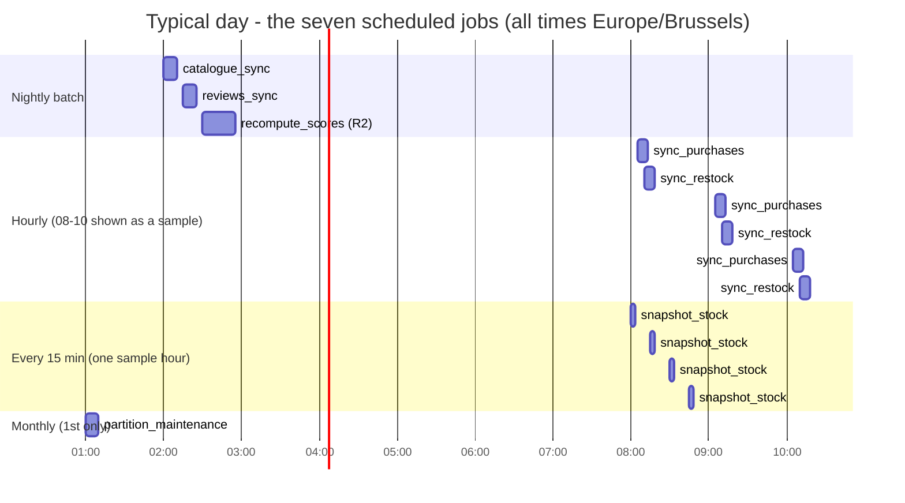

# FrigoLoco ERP - Scheduled Jobs (Cron Layer)

> **⚠ SCOPE NOTICE (2026-07-13):** this document was written ahead of the code and described a much larger job
> fleet than exists. It has been corrected against `cron/cron/scheduler.py`. **Exactly seven jobs are scheduled**
> (§1). Everything this document previously catalogued beyond those seven (alert scans, the email digest, the
> RFID-offline detector, auto-forecast, daily reconciliation) is **NOT BUILT** and is retained below only as
> roadmap intent, clearly labelled. Where this document and the code disagree, the code wins.
>
> Other corrections: **no Alembic** (plain SQL migrations via `backend/scripts/apply_schema.py`), **APScheduler
> worker in its own `cron/` container** (not in-process in FastAPI, not Railway cron), **`sync_run` + trailing-overlap
> re-pull** (there is no `sync_cursors` table, no `job_runs` table, no `backfill_checkpoints` table, and no
> `GET /health/jobs` endpoint).

> Layer: **CRON / JOBS** · APScheduler (`BlockingScheduler`) running in a **separate Docker container**
> (`python -m cron.scheduler`) · every job registered `max_instances=1` + `coalesce=True` so a slow run never
> overlaps itself or stacks missed fires · a failing job is logged and swallowed so it never kills the scheduler ·
> logs go to stdout.
>
> Code home: `cron/cron/` (`scheduler.py` = the seven registrations below, `jobs/<name>.py` = one module per job).
> The sync/transform logic itself lives in the backend (`app.husky.sync`) and is shared with the FastAPI sync API;
> the cron layer only orchestrates. Companion documents: [`../../cron/README.md`](../../cron/README.md) (the
> operational job reference, kept current) and [`../backend/README.md`](../backend/README.md).
>
> All cron expressions are evaluated in **`Europe/Brussels`**: delivery days and the ops team's clock are Belgian,
> so UTC crons would drift an hour twice a year.

---

## 1. Job catalogue

These are the **seven** jobs registered in `cron/cron/scheduler.py`. Each is also runnable standalone as
`python -m cron.jobs.<job id>`. Every job archives the raw payload **before** transforming it, writes a `sync_run`
row (start, then finish/failed), and upserts via `ON CONFLICT` on the key below, so re-runs and overlapping windows
are free.

| Job id | Schedule (cron) | What it does | Reads → Writes | Idempotency mechanism | Failure behavior |
|---|---|---|---|---|---|
| `sync_purchases` | `5 * * * *` (hourly @ :05) | Incremental pull of `GET /purchases` over a trailing 48 h window; normalizes cents/refunds/discounts | Husky API → `sales_events`, `sync_run` | Upsert `ON CONFLICT (husky_ref, sold_at)` | Logged, swallowed; the next hour's trailing window re-pulls the same period, so a missed run self-heals |
| `sync_restock` | `10 * * * *` (hourly @ :10) | Incremental pull of `GET /restock` (ADDED + REMOVED); maps tag status (`UNRELIABLE`/`UNRECOGNISED`) | Husky API → `restock_events`, `sync_run` | Upsert `ON CONFLICT (husky_ref, occurred_at)` | Same as purchases |
| `snapshot_stock` | `*/15 * * * *` | Pulls `GET /stock/current` and refreshes **fridge live stock** (see §1.1) | Husky API → `fridge_stock`, `sync_run` | Mark-and-sweep in one transaction, **scoped to the fridges the payload reported on**: upsert every payload row under one run-wide `taken_at`, then delete the older-`taken_at` rows **of those fridges only**. A fridge absent from the payload keeps its rows and its old `taken_at` (the signal the reader uses to flag it stale); sweeping globally would wipe it and the allocation engine would over-dispatch it to full target | Logged, swallowed (the next tick is 15 min away). An **empty payload never sweeps**: that means a vendor problem, not empty fridges |
| `catalogue_sync` | `0 2 * * *` (nightly 02:00) | Syncs the master catalogue: `GET /producttype`, fridges, clients, per-fridge price overrides | Husky API → `products`, `fridges`, `clients`, `fridge_product_prices`, `sync_run` | Upsert on `code` / `husky_id` / name / `(fridge_id, product_id)`; no deletes | Logged, swallowed; scoring still runs on yesterday's catalogue |
| `reviews_sync` | `15 2 * * *` (nightly 02:15) | Incremental pull of `GET /productreview` over a trailing 14 d window | Husky API → `product_reviews`, `sync_run` | Upsert on a synthesized `husky_ref` | Logged, swallowed; scoring proceeds with existing reviews |
| `recompute_scores` | `30 2 * * *` (nightly 02:30) | **R2**: trailing-365-day product scores | `sales_events`, `restock_events`, `product_reviews`, `products`, `settings` → `product_scores` | Deterministic recompute keyed on `(product_id, period_end)`; a re-run overwrites the same rows | Logged, swallowed; yesterday's scores remain in force, so menus/allocation degrade gracefully |
| `partition_maintenance` | `0 1 1 * *` (monthly, 1st @ 01:00) | Creates next month's partitions for the partitioned event tables (plus, for safety, the month after) | `pg_catalog` → DDL `CREATE TABLE ... PARTITION OF` | `CREATE TABLE IF NOT EXISTS`, so a re-run is a no-op | Logged, swallowed. Double-ahead creation gives a one-month buffer, which is the real protection: a missing partition would break the hourly syncs at month rollover |

Plus `python -m cron.jobs.backfill`: a **CLI-only entry point, not scheduled** (see §4).

Ordering rationale for the nightly chain: catalogue (02:00) and reviews (02:15) land **before** scoring (02:30), so
scores always use the freshest inputs.

**Failure handling is uniform and simple:** `_run_safely` in `scheduler.py` catches, logs and swallows any exception
so one bad job never kills the scheduler. There is **no in-run retry ladder, no `job_runs` table, no consecutive-failure
escalation and no alerting on job failure** - the sync jobs are self-healing because their trailing windows re-pull
what a failed run missed, and failures are found in the container logs and the `sync_run` table. Automated escalation
is **NOT BUILT**.

### 1.1 What `snapshot_stock` actually maintains: fridge live stock

`fridge_stock` is **not** warehouse stock. Keep the two apart:

- **Warehouse stock** is DERIVED, never stored: the `v_stock_balances` view computes it from `stock_movements` plus
  pending `purchase_order_lines`. Per product, **no fridge dimension**. No cron job touches it.
- **Fridge live stock** IS stored: `fridge_stock` holds one row per `(fridge_id, product_code)` (that pair is the PK),
  columns `fridge_id, product_code, product_id` (nullable), `units`, `taken_at`. It is the only source of fridge-level
  stock, and `snapshot_stock` is its only writer.

Because the refresh is mark-and-sweep, the table always mirrors **exactly** what the vendor reported in the last run:
a fridge or product that disappears from the feed disappears from the table, and a missing row means "not in that
fridge right now" (live = 0). **No history is retained, and none is needed** - nothing ever read it, only the newest
value per (fridge, product) was ever queried, so there is no retention or downsampling question to re-open.

Its **sole consumer** is the menu allocation engine (`backend/app/services/menu_allocation_service.py`), which uses it
for the snacks/drinks branch: `restock = max(target_qty - live, 0)`. **No API endpoint and no frontend page reads it.**

**Freshness is guarded in the reader, not here.** `menu_allocation_service` compares the newest `taken_at` against
`STOCK_READING_MAX_AGE` (2 h). If the generation is older than that or absent, allocation still runs on last-known
units, but every `target_replenish` line is flagged `stock_stale=True` (surfaced as `AllocationLineOut.stock_stale`)
and a warning is logged. This job does **not** check its own staleness, does not raise an alert, and does not report
to any health endpoint. Earlier revisions of this document claimed a "stale > 2 h" cron alert: that never existed.

### 1.2 Jobs that are NOT BUILT

Retained as roadmap intent from the spec's Phase 5. **None of these exist in code** - do not cite them as behaviour,
and note that the Power Automate alert emails they were meant to replace are therefore **still in service**:

| Planned job | Intended purpose | Status |
|---|---|---|
| `below_target_alerts` | Fridge live stock vs `product_targets`, alert on shortfalls | **NOT BUILT** (and there is no `v_below_target` view and no `GET /reports/below-target` endpoint) |
| `expiry_alerts` | Flag tags in fridges nearing DLC | **NOT BUILT**. No per-tag expiry data is stored, so this needs a data source first |
| `low_stock_alerts` | Warehouse balances vs per-product thresholds | **NOT BUILT** |
| `rfid_offline_detector` | Active fridge with zero sales for N hours implies an RFID/network outage | **NOT BUILT**. This is a real gap: when one fridge's RFID drops out while the others still report, its rows are swept from `fridge_stock`, so it reads as empty (not stale) and allocation over-dispatches to the full target |
| `alert_email_digest` | Daily email digest of alerts | **NOT BUILT**. No email or digest path exists anywhere in the codebase |
| `auto_forecast` | Pre-create a draft dispatch per delivery day | **NOT BUILT**. Ops runs the forecast from the UI (`POST /forecasts/run`) |
| `daily_husky_reconciliation` | Compare API event counts vs local tables, alert on divergence | **NOT BUILT**. There is no `reconciliation_daily` table and no reconciliation job of any kind |

`AlertType` declares `expiry` / `low_stock` / `below_target` / `negative_blocked` / `rfid_offline`, but
**only `negative_blocked` is ever constructed** (`backend/app/services/dispatch_service.py`, when a dispatch would
drive warehouse stock negative). Every other alert class is a declared enum value with no producer.

---

## 2. A typical day


```mermaid
gantt
    title Typical day - the seven scheduled jobs (all times Europe/Brussels)
    dateFormat HH:mm
    axisFormat %H:%M

    section Nightly batch
    catalogue_sync            :n1, 02:00, 10m
    reviews_sync              :n2, 02:15, 10m
    recompute_scores (R2)     :n3, 02:30, 25m

    section Hourly (08-10 shown as a sample)
    sync_purchases            :h1, 08:05, 8m
    sync_restock              :h2, 08:10, 8m
    sync_purchases            :h4, 09:05, 8m
    sync_restock              :h5, 09:10, 8m
    sync_purchases            :h7, 10:05, 8m
    sync_restock              :h8, 10:10, 8m

    section Every 15 min (one sample hour)
    snapshot_stock            :s1, 08:00, 3m
    snapshot_stock            :s2, 08:15, 3m
    snapshot_stock            :s3, 08:30, 3m
    snapshot_stock            :s4, 08:45, 3m

    section Monthly (1st only)
    partition_maintenance     :p1, 01:00, 10m
```

The hourly and 15-minute jobs repeat around the clock: the gantt shows a sample window. `partition_maintenance` runs
only on the 1st of the month. Nothing runs in the morning or afternoon: the alert scans, the email digest and the
auto-forecast that earlier revisions charted here are **NOT BUILT** (§1.2).

---

## 3. Scheduling architecture

### A standalone APScheduler worker

The scheduler is a **`BlockingScheduler` in its own Docker container**, started by `python -m cron.scheduler`. It is
**not** in-process inside FastAPI: an earlier revision of this document described an `AsyncIOScheduler` in the FastAPI
lifespan hook behind a `SCHEDULER_ENABLED` flag. That design was dropped, and no such flag exists.

```
python -m cron.scheduler        (cron/Dockerfile, its own Railway service)
  └─ BlockingScheduler(timezone="Europe/Brussels")
       └─ for each of the seven jobs:
            add_job(_run_safely, trigger=CronTrigger(...),
                    max_instances=1, coalesce=True, misfire_grace_time=300)
```

Each job is a plain callable in `cron/cron/jobs/<name>.py` exposing `run()`, so the same code path serves the
scheduler and the manual CLI (`python -m cron.jobs.<name>`).

### 3.1 Overlap and misfire protection

- `max_instances=1`: a slow run can never overlap itself.
- `coalesce=True`: if the container was down and several fires were missed, they collapse into one catch-up run
  rather than stacking.
- `misfire_grace_time=300`: a fire more than 5 minutes late is dropped rather than run at the wrong time.

**Single-instance locking is NOT BUILT.** There are no PostgreSQL advisory locks. Correctness today rests on running
**exactly one scheduler container**. If the cron service is ever scaled past one replica, both replicas will fire every
job, and an advisory lock (or equivalent) has to be added first. The idempotent upserts make a duplicate sync run
harmless in practice, but the mark-and-sweep in `snapshot_stock` is the one job where concurrent runs are genuinely
unsafe.

### 3.2 Run bookkeeping - `sync_run`

There is **no `job_runs` table**. The Husky-facing jobs write to **`sync_run`** instead, one row per chunk:
`job`, `endpoint`, `window_from`, `window_to`, `status` (`running` / `success` / `empty` / `failed`),
`records_fetched`, `records_upserted`, `blob_path`, `error`, `started_at`, `finished_at`. This is also what makes the
backfill resumable (§4). There is no retention pruning job.

`sync_run` and `fridge_stock` are the **only** bookkeeping tables. `job_runs`, `sync_cursors`, `backfill_checkpoints`,
`live_stock_snapshot`, `generated_documents` and `reconciliation_daily` were all designed here but **never built**.

### 3.3 Retry policy

- **Within a run: none.** `_run_safely` catches the exception, logs it, and returns. There is no retry ladder and no
  exponential backoff. (The HTTP client has its own throttle, but the job does not re-attempt.)
- **Across runs**: the sync jobs are self-healing by design. They pull a **trailing window** (48 h for purchases and
  restock, 14 d for reviews) rather than advancing a cursor, so the next scheduled tick re-pulls whatever a failed run
  missed, and the idempotent upserts make the replay free.
- **Escalation: NOT BUILT.** Nothing counts consecutive failures and nothing raises an alert when a job fails.

### 3.4 Monitoring

Today: **container logs plus the `sync_run` table.** That is the whole of it.

**NOT BUILT** (all three were described here as if they existed):
- `GET /health/jobs`. There is no health router in the backend at all.
- A job-failure alerts inbox. No job writes an `alerts` row, and there is no email or digest path.
- A cron-side freshness guard with a `skipped_stale_input` status. The only freshness guard that exists is the 2 h
  `STOCK_READING_MAX_AGE` check in the **menu allocation reader** (§1.1), which flags lines `stock_stale` rather than
  skipping anything.

---

## 4. One-time Husky backfill - runbook

Goal: 12+ months of history in `sales_events` / `restock_events` / `product_reviews` so scoring (R2, 365-day window) and forecasting (R1, and the flagged 6–12-month windows) have full data from day one. Runs once in Phase 1 (step 1.5), before the shadow-mode gate (1.8).

### Prerequisites

1. Husky credentials in env (`FRIGOLOCO_API_USERNAME` / `FRIGOLOCO_API_PASSWORD` / `FRIGOLOCO_API_BASE_URL`), read from the repo-root `.env` via the backend `Settings`.
2. Rate limits and history retention **confirmed with Husky** (spec Manual Step 2). The chunk pacing below is a conservative default to adjust once real limits are known - do not assume documented limits exist.
3. Schema applied via `backend/scripts/apply_schema.py` (plain SQL, **no Alembic**), with monthly partitions pre-created for the entire backfill range.
4. Run `catalogue_sync` first (see below): products and fridges must exist before any event can be normalized.

### Order of operations (dependencies flow downward)

| Step | Feed | Why this order | Chunking |
|---|---|---|---|
| 1 | `catalogue_sync` (products, fridges, clients, prices) | Products and the fridge id mapping (`friendlyName` **and** `fridge.name` → internal id) must exist before event normalization | Single pull |
| 2 | `backfill --endpoint purchases` | Largest volume; feeds scoring + forecast | **7-day chunks** |
| 3 | `backfill --endpoint restock` | Scoring denominator (%sold) | 7-day chunks |
| 4 | `backfill --endpoint reviews` | Scoring review component | 7-day chunks (small) |
| 5 | Verify | Re-run counts and spot-check against the API | - |

### Resumability

There is **no `backfill_checkpoints` table**. `cron/cron/jobs/backfill.py` reuses **`sync_run`** as its checkpoint
log, which is why it needs no bookkeeping of its own:

- It walks `--from`/`--to` in **7-day chunks**, delegating each chunk to the matching incremental sync job, so the
  raw-first archive, the `sync_run` row and the idempotent upsert are all reused.
- **Resumable:** a chunk whose `sync_run` already recorded `success` or `empty` for the same job + endpoint + window is
  skipped, so re-running the whole command after a crash is always safe.
- **Self-healing:** a chunk that raises is halved and each half retried, down to a 1-day floor, isolating a poison
  window instead of failing the whole run.
- `--dry-run` prints the window plan (including which windows would be skipped) without calling the vendor or writing
  anything.
- **Acceptance check (spec 1.5): running the entire backfill twice must yield identical row counts.**

### Duration & rate expectations

Working numbers (validate against Husky's real limits in Manual Step 2):

- Volume: the year-one target is ~5-10 M events (spec acceptance criteria), i.e. roughly 400-800 k events/month across purchases + restock.
- Pacing: one 7-day chunk per feed at a time, sequential, throttled by `HUSKY_THROTTLE_RPS`. A chunk that fails is halved automatically (7 d → 3 d → 1 d floor).
- Ballpark wall-clock: **2-6 hours** for 12 months of purchases + restock at those volumes; reviews add minutes. Run it from a one-off command against the cron image (`python -m cron.jobs.backfill --endpoint purchases --from 2025-06-01 --to 2026-06-01`), never inside the web process.

### Post-backfill

1. Run the count verification across all chunks; archive the report.
2. Start the scheduler container. The hourly jobs need no cursor priming: they pull a trailing 48 h window, so they simply pick up from now.
3. Shadow mode (spec Phase 1.8) called for a `daily_husky_reconciliation` job showing < 0.1% divergence over 14 days before the workbook numbers were trusted to the new store. **That job is NOT BUILT**, so this gate has to be run as a manual comparison (or the job has to be written) before the cutover it was meant to protect.
