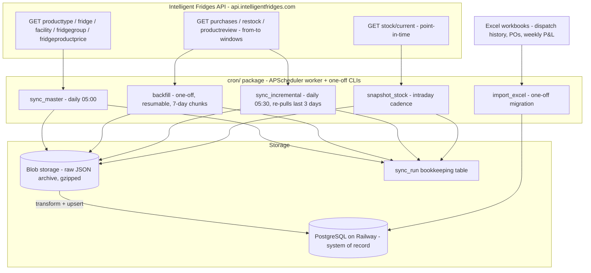

# Data-Sync Layer - Husky (Intelligent Fridges) Ingestion & Historical Backfill

> Companion to spec [`specs/0004-database-setup-and-husky-historical-backfill_2026-07-02_0810PM_UTC/`](../../specs/0004-database-setup-and-husky-historical-backfill_2026-07-02_0810PM_UTC/) (interactive HTML - answer its 10 open questions there).
> This layer feeds the database that `architecture/database/`, `architecture/backend/` and `architecture/cron/` build on. The vendor OpenAPI spec copy lives in the spec's `reference-docs/intelligentfridges_openapi_v1.json`.

## What this layer is

Everything between the Intelligent Fridges API and PostgreSQL: the typed API client, the raw-payload blob archive, the one-off historical backfill, the steady-state incremental syncs, and the one-off Excel history importer. It is the only layer that talks to the vendor.

## Verified API contract (the parts that shape the design)

| Fact | Consequence |
|---|---|
| Basic auth only; no API keys/OAuth | Credentials live in env (`FRIGOLOCO_API_*` keys, see `CLAUDE.md`); request a dedicated integration user from the vendor (spec Q6) |
| **No pagination on any endpoint** | Backfill walks 7-day `from`/`to` windows; auto-halves a window on oversized responses |
| Prices are `int64` minor units | DB stores integer cents end-to-end; a single euros→cents conversion exists (Excel import) |
| `/stock/current` has no history | `snapshot_stock` cron is time-critical - every day not snapshotted is training data lost |
| No documented rate limits | ≤1 req/s throttle + exponential backoff; full 5-year backfill ≈ 800 requests ≈ 15 min |
| Restock supports `action` ADDED/REMOVED/UNCHANGED and `status` VALID/UNRELIABLE/UNRECOGNISED | Pull **unfiltered** (legacy scripts only pulled ADDED); REMOVED powers the withdrawal-list / residual-stock features |

## Idempotency (natural dedupe keys)

| Table | Conflict key | Source |
|---|---|---|
| `purchase` | `(tag_id, purchased_at)` | RFID tag id per sold item |
| `restock_session` / `restock_tag` | `husky_session_id` (+ cascade) | API session map key |
| `product_review` | `(product_code, fridge_id, reviewed_at, rating)` | no vendor id exposed |
| `stock_snapshot` | `(taken_at, fridge_id, product_code)` | one `taken_at` per run |
| master rows | `product_code` / `husky_name` / names | upsert; absent products become `is_active=false`, never deleted |

All writes are `INSERT … ON CONFLICT DO UPDATE`, so every job can be re-run safely; `sync_incremental`'s trailing 3-day overlap exploits this to catch late refunds/status changes.

## How the other layers consume this one

- **Database layer** (`architecture/database/`): owns the app-facing schema; this layer populates the event/master tables (`purchase`, `restock_*`, `stock_snapshot`, `product_review`, `product`, `fridge`, `client`, `fridge_product_price`) plus Excel-migrated history. Aggregate tables in the legacy workbooks become SQL views over these facts - the copy-paste financial pipeline disappears.
- **Backend layer** (`architecture/backend/`): FastAPI services read the synced tables; nothing in the request path ever calls the vendor API synchronously (latency + rate-limit isolation). Live-telemetry needs (fridge state, RFID-offline alert) go through dedicated cron polls, not request-time calls.
- **Cron layer** (`architecture/cron/`): the job catalogue there schedules the four movers here (`sync_master` 05:00, `sync_incremental` 05:30, `snapshot_stock` intraday, `backfill` on demand). **Scheduler = APScheduler** (user decision 2026-07-03, spec Q4 answered): a long-running worker (`python -m cron.scheduler`) in its own container; every job is also a plain CLI (`python -m cron.jobs.<name>`) for manual runs.
- **Frontend** (`mockups/`): forecast/finance screens render data whose freshness = last green `sync_run`; surface `sync_run.finished_at` as the "data as of" stamp shown in the UI.

## Runbook (condensed - full plan in spec 0004)

1. `alembic upgrade head` (schema + seeds)
2. `python -m app.jobs.sync_master` (catalogue, fridges, facilities, prices)
3. `python -m app.jobs.backfill --dry-run` → review window plan → run for real (resumable; check `sync_run` for `failed` rows)
4. `python -m app.migration.import_excel` (workbook history; fails loudly on unmapped fridge/supplier names)
5. Reconciliation gate: DB aggregates vs `WeeklySummaryDataTable` for 4 sample weeks (≤1 % deviation) before sign-off
6. Enable the three cron schedules on Railway
