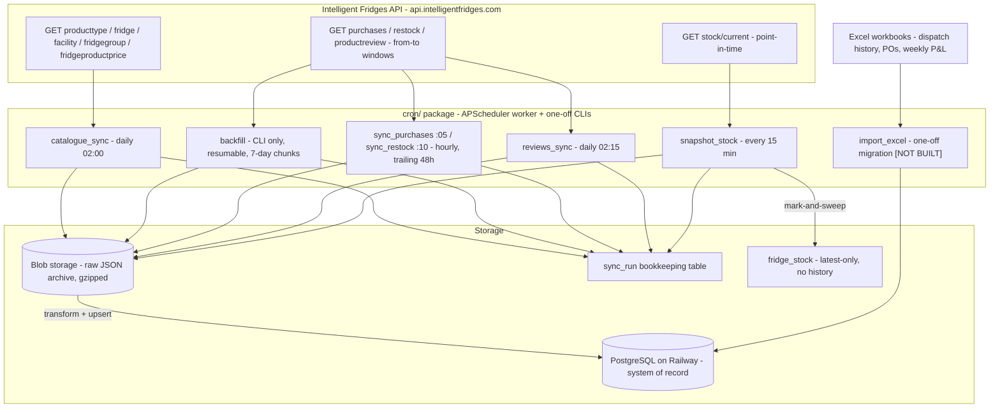

# Data-Sync Layer - Husky (Intelligent Fridges) Ingestion & Historical Backfill

> Companion to spec [`specs/0004-database-setup-and-husky-historical-backfill_2026-07-02_0810PM_UTC/`](../../specs/0004-database-setup-and-husky-historical-backfill_2026-07-02_0810PM_UTC/) (interactive HTML - answer its 10 open questions there).
> This layer feeds the database that `architecture/database/`, `architecture/backend/` and `architecture/cron/` build on. The vendor OpenAPI spec copy lives in the spec's `reference-docs/intelligentfridges_openapi_v1.json`.

## What this layer is

Everything between the Intelligent Fridges API and PostgreSQL: the typed API client, the raw-payload blob archive, the one-off historical backfill, the steady-state incremental syncs, and the one-off Excel history importer. It is the only layer that talks to the vendor.

```mermaid
flowchart TD
    subgraph API["Intelligent Fridges API - api.intelligentfridges.com"]
        EPM["GET producttype / fridge / facility / fridgegroup / fridgeproductprice"]
        EPE["GET purchases / restock / productreview - from-to windows"]
        EPS["GET stock/current - point-in-time"]
    end
    subgraph JOBS["cron/ package - APScheduler worker + one-off CLIs"]
        MS["catalogue_sync - daily 02:00"]
        BF["backfill - CLI only, resumable, 7-day chunks"]
        DS["sync_purchases :05 / sync_restock :10 - hourly, trailing 48h"]
        RV["reviews_sync - daily 02:15"]
        SS["snapshot_stock - every 15 min"]
        IMP["import_excel - one-off migration [NOT BUILT]"]
    end
    subgraph STORE["Storage"]
        BLOB[("Blob storage - raw JSON archive, gzipped")]
        PG[("PostgreSQL on Railway - system of record")]
        SR["sync_run bookkeeping table"]
        FS["fridge_stock - latest-only, no history"]
    end
    XL["Excel workbooks - dispatch history, POs, weekly P&amp;L"] --> IMP
    EPM --> MS
    EPE --> BF
    EPE --> DS
    EPE --> RV
    EPS --> SS
    MS --> BLOB
    BF --> BLOB
    DS --> BLOB
    RV --> BLOB
    SS --> BLOB
    BLOB -->|"transform + upsert"| PG
    IMP --> PG
    MS --> SR
    BF --> SR
    DS --> SR
    RV --> SR
    SS --> SR
    SS -->|"mark-and-sweep"| FS
```

## Verified API contract (the parts that shape the design)

| Fact | Consequence |
|---|---|
| Basic auth only; no API keys/OAuth | Credentials live in env (`FRIGOLOCO_API_*` keys, see `CLAUDE.md`); request a dedicated integration user from the vendor (spec Q6) |
| **No pagination on any endpoint** | Backfill walks 7-day `from`/`to` windows; auto-halves a window on oversized responses |
| Prices are `int64` minor units | DB stores integer cents end-to-end; a single euros→cents conversion exists (Excel import) |
| `/stock/current` has no history | `snapshot_stock` (every 15 min) is time-critical for **current accuracy**, not for history: it is the only source of fridge-level stock, and the menu allocation engine dispatches `restock = max(target_qty - live, 0)` off it, so a stale reading means a wrong dispatch. Fridge-stock **history is deliberately not retained** (`fridge_stock` is latest-only) and has no consumers - a missed run loses nothing but freshness |
| No documented rate limits | ≤1 req/s throttle + exponential backoff; full 5-year backfill ≈ 800 requests ≈ 15 min |
| Restock supports `action` ADDED/REMOVED/UNCHANGED and `status` VALID/UNRELIABLE/UNRECOGNISED | Pull **unfiltered** (legacy scripts only pulled ADDED); REMOVED powers the withdrawal-list / residual-stock features |

## Idempotency (natural dedupe keys)

| Table | Conflict key | Source |
|---|---|---|
| `sales_events` | `(husky_ref, sold_at)` | RFID tag id per sold item + sale timestamp |
| `restock_events` | `(husky_ref, occurred_at)` | RFID tag id per restocked item + event timestamp |
| `product_reviews` | synthesized `husky_ref` | no vendor id exposed |
| `fridge_stock` | `(fridge_id, product_code)` (the PRIMARY KEY) | latest-only; **not** a time series - see below |
| master rows (`products` / `fridges` / `clients` / `fridge_product_prices`) | `code` / `husky_id` / name / `(fridge_id, product_id)` | upsert; absent products become `is_active=false`, never deleted |

All writes are `INSERT … ON CONFLICT DO UPDATE`, so every job can be re-run safely; the hourly jobs' trailing 48h overlap exploits this to catch late refunds/status changes.

`fridge_stock` is the exception to plain upsert: `snapshot_stock` does **mark-and-sweep in one transaction** - upsert every row of the latest `/stock/current` payload with a single run-wide `taken_at`, then DELETE every row that run did not touch. The table therefore mirrors exactly what the vendor reported on the last run: a product (or a whole fridge) that drops out of the feed drops out of the table, and a missing row means "not in that fridge right now" (live = 0). Guard: an **empty payload never triggers the sweep** (an empty response means a vendor problem, not "all fridges empty"). Migration: `backend/scripts/migrations/0009_fridge_stock_latest_only.sql`.

## How the other layers consume this one

- **Database layer** (`architecture/database/`): owns the app-facing schema; this layer populates the event/master tables (`sales_events`, `restock_events`, `fridge_stock`, `product_reviews`, `products`, `fridges`, `clients`, `fridge_product_prices`) plus Excel-migrated history. Aggregate tables in the legacy workbooks become SQL views over these facts - the copy-paste financial pipeline disappears.
- **Backend layer** (`architecture/backend/`): FastAPI services read the synced tables; nothing in the request path ever calls the vendor API synchronously (latency + rate-limit isolation). `fridge_stock` has exactly **one** consumer, `backend/app/services/menu_allocation_service.py` (snacks/drinks branch `restock = max(target_qty - live, 0)`, with a 2h `STOCK_READING_MAX_AGE` freshness flag on the reading); it has **no API endpoint and no frontend surface**, and it is NOT the warehouse stock the Stock page shows (that is `v_stock_balances`, derived from `stock_movements`, per product with no fridge dimension). **NOT BUILT:** live-telemetry polling (fridge state / RFID-offline detection) - there is no such cron job and no RFID-offline alert; a single fridge dropping off the feed is currently undetected.
- **Cron layer** (`architecture/cron/`): the movers here are `catalogue_sync` (daily 02:00, master data), `sync_purchases` (hourly :05) and `sync_restock` (hourly :10) for events, `reviews_sync` (daily 02:15), `snapshot_stock` (every 15 min), plus `backfill` as a CLI-only, non-scheduled entry point. See `cron/README.md` for the authoritative catalogue (seven scheduled jobs in total). **Scheduler = APScheduler** (user decision 2026-07-03, spec Q4 answered): a long-running worker (`python -m cron.scheduler`) in its own container; every job is also a plain CLI (`python -m cron.jobs.<name>`) for manual runs.
- **Frontend** (`mockups/`): forecast/finance screens render data whose freshness = last green `sync_run`; surface `sync_run.finished_at` as the "data as of" stamp shown in the UI.

## Runbook (condensed - full plan in spec 0004)

1. `python backend/scripts/apply_schema.py` + the numbered SQL migrations under `backend/scripts/migrations/` (schema + seeds). **No Alembic** - it is banned in this project; migrations are plain SQL scripts run directly against the DB.
2. `python -m cron.jobs.catalogue_sync` (catalogue, fridges, facilities, prices)
3. `python -m cron.jobs.backfill --dry-run` → review window plan → run for real (resumable; check `sync_run` for `failed` rows)
4. Excel history import (workbook history; fails loudly on unmapped fridge/supplier names) - **NOT BUILT**: no `import_excel` job exists yet
5. Reconciliation gate: DB aggregates vs `WeeklySummaryDataTable` for 4 sample weeks (≤1 % deviation) before sign-off. Manual - there is no reconciliation job
6. Start the APScheduler worker container (`python -m cron.scheduler`), which owns all seven schedules in code
