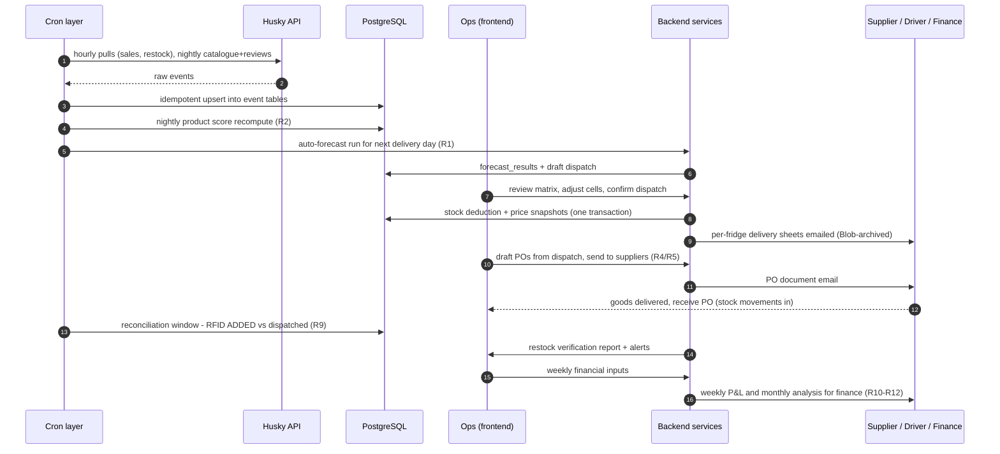

# FrigoLoco Cloud ERP - System Overview: How the Layers Link Up

> Companion to spec [`specs/0001-frigoloco-excel-to-cloud-erp_2026-07-02_0810PM_UTC/`](../specs/0001-frigoloco-excel-to-cloud-erp_2026-07-02_0810PM_UTC/).
> This document is the map; the per-layer documents are the territory.

## The four layers and their artifacts

| Layer | Artifact | What it contains |
|---|---|---|
| **Database** | [`architecture/database/schema.sql`](database/schema.sql) + [README](database/README.md) | Full PostgreSQL DDL: ~27 tables, enums, stock non-negativity trigger, event partitioning, order-number sequence, stock balances view, seed data |
| **Backend** | [`architecture/backend/README.md`](backend/README.md) | FastAPI modular monolith: routers → Pydantic schemas → domain services → SQLAlchemy models; transactional flows; role matrix; env config |
| **Cron / jobs** | [`architecture/cron/README.md`](cron/README.md) | APScheduler job catalogue (Husky syncs, scoring, auto-forecast, alerts, maintenance), backfill runbook, single-instance locking |
| **Frontend** | [`mockups/frigoloco-dispatch-app-mockup.html`](../mockups/frigoloco-dispatch-app-mockup.html), [`mockups/frigoloco-supply-app-mockup.html`](../mockups/frigoloco-supply-app-mockup.html), [`mockups/frigoloco-returns-app-mockup.html`](../mockups/frigoloco-returns-app-mockup.html) | Static HTML mockups of every page, sharing one design system; the React app implements these |

## Layer linkage at a glance

```mermaid
flowchart TB
    subgraph FE["Frontend - React SPA (mockups in mockups/)"]
        P1["Dispatch Matrix"]
        P2["Menu Planner"]
        P3["Forecast"]
        P4["Purchase Orders"]
        P5["Stock"]
        P6["Restock Verification"]
        P7["Finance / Returns"]
        P8["Clients, Products, Alerts, Settings"]
        P9["Driver View (mobile)"]
    end
    subgraph API["Backend - FastAPI routers (/api/v1)"]
        R1["/dispatches"]
        R2["/menus"]
        R3["/forecasts"]
        R4["/purchase-orders"]
        R5["/stock"]
        R6["/finance"]
        R7["/clients /products /alerts /settings"]
    end
    subgraph SVC["Domain services"]
        S1["dispatch.py + documents.py + email.py"]
        S2["menu_allocation.py"]
        S3["forecast.py + scoring.py"]
        S4["orders.py"]
        S5["stock.py"]
        S6["reconciliation.py"]
        S7["finance.py"]
    end
    subgraph DB["PostgreSQL (architecture/database/schema.sql)"]
        D1[("dispatches, dispatch_lines")]
        D2[("weekly_menus, menu_products, product_targets")]
        D3[("forecast_runs, forecast_results, product_scores")]
        D4[("purchase_orders, purchase_order_lines")]
        D5[("stock_movements + v_stock_balances")]
        D6[("sales_events, restock_events, product_reviews")]
        D7[("weekly_financials, clients, fridges, products, settings, alerts, audit_log")]
    end
    subgraph CRON["Cron layer - APScheduler (architecture/cron/)"]
        J1["Husky syncs: purchases, restock, reviews, catalogue, live stock"]
        J2["Nightly score recompute"]
        J3["Auto-forecast per delivery day"]
        J4["Alert scans + email digest"]
        J5["Partition + reconciliation maintenance"]
    end
    HUSKY["Husky RFID API"]
    BLOB[("Azure Blob")]
    MAILX["Email (suppliers, drivers, ops)"]
    P1 --> R1
    P2 --> R2
    P3 --> R3
    P4 --> R4
    P5 --> R5
    P6 --> R1
    P7 --> R6
    P8 --> R7
    P9 --> R1
    R1 --> S1
    R1 --> S6
    R2 --> S2
    R3 --> S3
    R4 --> S4
    R5 --> S5
    R6 --> S7
    S1 --> D1
    S1 --> D5
    S1 --> BLOB
    S1 --> MAILX
    S2 --> D2
    S3 --> D3
    S3 --> D6
    S4 --> D4
    S4 --> D5
    S5 --> D5
    S6 --> D6
    S6 --> D1
    S7 --> D6
    S7 --> D7
    J1 --> HUSKY
    J1 --> D6
    J2 --> D3
    J3 --> S3
    J3 --> D1
    J4 --> D7
    J4 --> MAILX
    J5 --> D6
```

Reading the diagram top-to-bottom: **pages call routers, routers call services, services own tables**. The cron layer is the only writer of the raw event tables (`sales_events`, `restock_events`, `product_reviews`) and the only caller of the Husky API besides the pass-through live-stock endpoint - every user-facing feature reads local data.

## Page → endpoint → service → table contract

| Frontend page (mockup) | Calls endpoints | Service | Primary tables | Fed by cron jobs |
|---|---|---|---|---|
| Dispatch Matrix (dispatch app) | `GET /dispatches/{id}/matrix`, `PUT …/lines`, `POST …/apply-forecast`, `POST …/confirm` | `dispatch.py`, `menu_allocation.py` | `dispatches`, `dispatch_lines`, `stock_movements` | `auto_forecast` pre-creates the draft |
| Menu Planner (dispatch app) | `GET/POST /menus`, `POST /menus/{id}/copy`, `PUT …/products` | `menu_allocation.py` | `weekly_menus`, `menu_products`, `menu_product_caps`, `product_targets` | `husky_catalogue_sync` keeps the product picker current |
| Forecast (dispatch app) | `POST /forecasts/run`, `GET /forecasts/latest`, `GET /forecasts/performance` | `forecast.py`, `scoring.py` | `forecast_runs`, `forecast_results`, `sales_events`, `product_scores` | `husky_sync_purchases`, `recompute_product_scores` |
| Restock Verification (dispatch app) | `POST /dispatches/{id}/reconcile`, `GET` report | `reconciliation.py` | `restock_verifications(_lines)`, `restock_events`, `dispatch_lines` | `husky_sync_restock` |
| Driver View (dispatch app) | `GET /dispatches?date=today` (role: driver) | `dispatch.py`, `documents.py` | `dispatch_lines`, fridge master data | - |
| Purchase Orders (supply app) | `GET/POST /purchase-orders`, `…/send`, `…/receive`, `…/cancel`, `draft-from-dispatch` | `orders.py`, `documents.py`, `email.py` | `purchase_orders`, `purchase_order_lines`, `stock_movements` | - |
| Stock (supply app) | `GET /stock/balances`, `POST /stock/adjustments`, `GET /stock/movements` | `stock.py` | `stock_movements`, `v_stock_balances` | `low_stock_alerts` |
| Clients & Fridges / Products (supply app) | CRUD `/clients`, `/fridges`, `/products` | thin CRUD | `clients`, `fridges`, `fridge_delivery_config`, `products`, `fridge_product_prices` | `husky_catalogue_sync` |
| Alerts & Settings (supply app) | `GET /alerts`, `PUT /alerts/{id}/ack`, `GET/PUT /settings` | - | `alerts`, `settings` | all alert scan jobs |
| Weekly / Monthly Returns (returns app) | `GET/PUT /finance/weekly/{y}/{w}`, `GET /finance/monthly`, `GET /finance/fridge-report` | `finance.py` | `weekly_financials`, `sales_events`, `client_fees`, `client_service_charges` | `husky_sync_purchases` |

## The operating cycle across all layers

(R-numbers reference the business-rules registry in the spec's Background section.)

## Cross-layer invariants

1. **Stock can never go negative** - enforced by a database trigger on `stock_movements` (layer: DB), surfaced as HTTP 409 (layer: backend), rendered as blocking red cells / toasts (layer: frontend), and logged as a `negative_blocked` alert (layer: cron digest).
2. **Raw RFID events are append-only and cron-owned** - services never write them; syncs are idempotent on the Husky reference so re-runs are safe (this is what makes every report reproducible).
3. **Prices are snapshotted at transaction time** - `dispatch_lines` and `purchase_order_lines` carry their own unit prices; catalogue price changes never rewrite history (Excel had this right via copied values; the DB keeps it).
4. **Every mutation is attributed** - `created_by` + `audit_log` from the backend's auth context; the Excel system's "no timestamp on saves" defect cannot recur.
5. **One tunable configuration source** - scoring weights, forecast margins, fees, thresholds live in `settings` (DB) and are read by services and cron jobs alike; no constants buried in code, mirroring (but centralizing) the workbook's tunable cells.

> **Known delta:** the cron layer defines six support tables of its own (`sync_cursors`, `job_runs`, `backfill_checkpoints`, `live_stock_snapshot`, `generated_documents`, `reconciliation_daily` - see [cron/README.md](cron/README.md)). They are deliberately not in `schema.sql` (which covers the domain model verified against Postgres) and land as the first Alembic migration in Phase 1.

## Deployment topology

Single Railway project: one PostgreSQL instance, one backend service (FastAPI + APScheduler in-process, Postgres advisory lock guards against double-scheduling if scaled), one static frontend. Azure Blob holds generated PO/dispatch documents. All secrets (Husky credentials, JWT secret, email, blob connection) are Railway environment variables - nothing in code.
