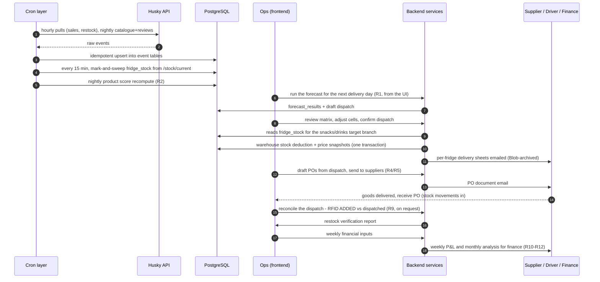

# FrigoLoco Cloud ERP - System Overview: How the Layers Link Up

> Companion to spec [`specs/0001-frigoloco-excel-to-cloud-erp_2026-07-02_0810PM_UTC/`](../specs/0001-frigoloco-excel-to-cloud-erp_2026-07-02_0810PM_UTC/).
> This document is the map; the per-layer documents are the territory.

## The four layers and their artifacts

| Layer | Artifact | What it contains |
|---|---|---|
| **Database** | [`architecture/database/schema.sql`](database/schema.sql) + [README](database/README.md) | Full PostgreSQL DDL: ~27 tables, enums, stock non-negativity trigger, event partitioning, order-number sequence, stock balances view, seed data |
| **Backend** | [`architecture/backend/README.md`](backend/README.md) | FastAPI modular monolith: routers → Pydantic schemas → domain services → SQLAlchemy models; transactional flows; role matrix; env config |
| **Cron / jobs** | [`architecture/cron/README.md`](cron/README.md) | The seven scheduled jobs (Husky event syncs, catalogue sync, fridge-stock snapshot, scoring, partition maintenance), plus the CLI-only backfill runbook. The auto-forecast and alert-scan jobs described in earlier revisions are NOT BUILT |
| **Frontend** | [`mockups/frigoloco-dispatch-app-mockup.html`](../mockups/frigoloco-dispatch-app-mockup.html), [`mockups/frigoloco-supply-app-mockup.html`](../mockups/frigoloco-supply-app-mockup.html), [`mockups/frigoloco-returns-app-mockup.html`](../mockups/frigoloco-returns-app-mockup.html) | Static HTML mockups of every page, sharing one design system; the React app implements these |

## Layer linkage at a glance

```mermaid
flowchart TB
    subgraph FE["Frontend - React SPA (mockups in mockups/)"]
        P1["Dispatch Matrix"]
        P2["Menu Planner"]
        P3["Forecast"]
        P4["Purchase Orders"]
        P5["Stock"]
        P6["Restock Verification"]
        P7["Finance / Returns"]
        P8["Clients, Products, Alerts, Settings"]
        P9["Driver View (mobile)"]
    end
    subgraph API["Backend - FastAPI routers (/api/v1)"]
        R1["/dispatches"]
        R2["/menus"]
        R3["/forecasts"]
        R4["/purchase-orders"]
        R5["/stock"]
        R6["/finance"]
        R7["/clients /products /alerts /settings"]
    end
    subgraph SVC["Domain services"]
        S1["dispatch.py + documents.py + email.py"]
        S2["menu_allocation.py"]
        S3["forecast.py + scoring.py"]
        S4["orders.py"]
        S5["stock.py"]
        S6["reconciliation.py"]
        S7["finance.py"]
    end
    subgraph DB["PostgreSQL (architecture/database/schema.sql)"]
        D1[("dispatches, dispatch_lines")]
        D2[("weekly_menus, menu_products, product_targets")]
        D3[("forecast_runs, forecast_results, product_scores")]
        D4[("purchase_orders, purchase_order_lines")]
        D5[("WAREHOUSE stock: stock_movements + v_stock_balances")]
        D6[("sales_events, restock_events, product_reviews")]
        D7[("weekly_financials, clients, fridges, products, settings, alerts, audit_log")]
        D8[("FRIDGE live stock: fridge_stock")]
    end
    subgraph CRON["Cron layer - APScheduler worker container (architecture/cron/)"]
        J1["Husky syncs: sync_purchases, sync_restock, reviews_sync"]
        J2["catalogue_sync"]
        J3["snapshot_stock: mark-and-sweep fridge live stock"]
        J4["recompute_scores"]
        J5["partition_maintenance"]
    end
    HUSKY["Husky RFID API"]
    BLOB[("Azure Blob")]
    MAILX["Email (suppliers, drivers, ops)"]
    P1 --> R1
    P2 --> R2
    P3 --> R3
    P4 --> R4
    P5 --> R5
    P6 --> R1
    P7 --> R6
    P8 --> R7
    P9 --> R1
    R1 --> S1
    R1 --> S6
    R2 --> S2
    R3 --> S3
    R4 --> S4
    R5 --> S5
    R6 --> S7
    S1 --> D1
    S1 --> D5
    S1 --> BLOB
    S1 --> MAILX
    S2 --> D2
    S2 --> D8
    S3 --> D3
    S3 --> D6
    S4 --> D4
    S4 --> D5
    S5 --> D5
    S6 --> D6
    S6 --> D1
    S7 --> D6
    S7 --> D7
    J1 --> HUSKY
    J1 --> D6
    J2 --> HUSKY
    J2 --> D7
    J3 --> HUSKY
    J3 --> D8
    J4 --> D3
    J5 --> D6
```

Reading the diagram top-to-bottom: **pages call routers, routers call services, services own tables**. The cron layer is the only writer of the raw event tables (`sales_events`, `restock_events`, `product_reviews`) and the only caller of the Husky API. Every user-facing feature reads local data: there is **no pass-through live-stock endpoint** (an earlier revision of this document claimed one, and it has never existed).

**The two stock stores are different things and the diagram keeps them apart.** `D5` is **warehouse** stock: derived, never stored, computed by the `v_stock_balances` view from `stock_movements` plus pending `purchase_order_lines`, per product with no fridge dimension. `D8` is **fridge live** stock: stored, one row per `(fridge_id, product_code)`, refreshed wholesale every 15 min by `snapshot_stock` (mark-and-sweep, so the table mirrors exactly what Husky last reported, and no history is kept). `D8` has exactly one reader in the whole system, the menu allocation service (`S2`), which uses it for `restock = max(target_qty - live, 0)`. No router and no page reads it.

## Page → endpoint → service → table contract

| Frontend page (mockup) | Calls endpoints | Service | Primary tables | Fed by cron jobs |
|---|---|---|---|---|
| Dispatch Matrix (dispatch app) | `GET /dispatches/{id}/matrix`, `PUT …/lines`, `POST …/apply-forecast`, `POST …/confirm` | `dispatch.py`, `menu_allocation.py` | `dispatches`, `dispatch_lines`, `stock_movements`, `fridge_stock` (read) | - (the `auto_forecast` job that was to pre-create the draft is **NOT BUILT**; ops runs the forecast from the UI) |
| Menu Planner (dispatch app) | `GET/POST /menus`, `POST /menus/{id}/copy`, `PUT …/products` | `menu_allocation.py` | `weekly_menus`, `menu_products`, `menu_product_caps`, `product_targets` | `catalogue_sync` keeps the product picker current; `snapshot_stock` keeps `fridge_stock` current for the snacks/drinks branch |
| Forecast (dispatch app) | `POST /forecasts/run`, `GET /forecasts/latest`, `GET /forecasts/performance` | `forecast.py`, `scoring.py` | `forecast_runs`, `forecast_results`, `sales_events`, `product_scores` | `sync_purchases`, `recompute_scores` |
| Restock Verification (dispatch app) | `POST /dispatches/{id}/reconcile`, `GET` report | `reconciliation.py` | `restock_verifications(_lines)`, `restock_events`, `dispatch_lines` | `sync_restock` |
| Driver View (dispatch app) | `GET /dispatches?date=today` (role: driver) | `dispatch.py`, `documents.py` | `dispatch_lines`, fridge master data | - |
| Purchase Orders (supply app) | `GET/POST /purchase-orders`, `…/send`, `…/receive`, `…/cancel`, `draft-from-dispatch` | `orders.py`, `documents.py`, `email.py` | `purchase_orders`, `purchase_order_lines`, `stock_movements` | - |
| Stock (supply app) | `GET /stock/balances`, `POST /stock/adjustments`, `GET /stock/movements` | `stock.py` | `stock_movements`, `v_stock_balances` (**warehouse** stock only: no fridge dimension, and this page does not read `fridge_stock`) | - (the `low_stock_alerts` job is **NOT BUILT**) |
| Clients & Fridges / Products (supply app) | CRUD `/clients`, `/fridges`, `/products` | thin CRUD | `clients`, `fridges`, `fridge_delivery_config`, `products`, `fridge_product_prices` | `catalogue_sync` |
| Alerts & Settings (supply app) | `GET /alerts`, `PUT /alerts/{id}/ack`, `GET/PUT /settings` | - | `alerts`, `settings` | - (**no cron job writes an alert**: the only alert ever produced is `negative_blocked`, written by the backend dispatch service) |
| Weekly / Monthly Returns (returns app) | `GET/PUT /finance/weekly/{y}/{w}`, `GET /finance/monthly`, `GET /finance/fridge-report` | `finance.py` | `weekly_financials`, `sales_events`, `client_fees`, `client_service_charges` | `sync_purchases` |

## The operating cycle across all layers

```mermaid
sequenceDiagram
    autonumber
    participant CRON as Cron layer
    participant HUSKY as Husky API
    participant DB as PostgreSQL
    participant OPS as Ops (frontend)
    participant BE as Backend services
    participant SUP as Supplier / Driver / Finance
    CRON->>HUSKY: hourly pulls (sales, restock), nightly catalogue+reviews
    HUSKY-->>CRON: raw events
    CRON->>DB: idempotent upsert into event tables
    CRON->>DB: every 15 min, mark-and-sweep fridge_stock from /stock/current
    CRON->>DB: nightly product score recompute (R2)
    OPS->>BE: run the forecast for the next delivery day (R1, from the UI)
    BE->>DB: forecast_results + draft dispatch
    OPS->>BE: review matrix, adjust cells, confirm dispatch
    BE->>DB: reads fridge_stock for the snacks/drinks target branch
    BE->>DB: warehouse stock deduction + price snapshots (one transaction)
    BE->>SUP: per-fridge delivery sheets emailed (Blob-archived)
    OPS->>BE: draft POs from dispatch, send to suppliers (R4/R5)
    BE->>SUP: PO document email
    SUP-->>OPS: goods delivered, receive PO (stock movements in)
    OPS->>BE: reconcile the dispatch - RFID ADDED vs dispatched (R9, on request)
    BE->>OPS: restock verification report
    OPS->>BE: weekly financial inputs
    BE->>SUP: weekly P&L and monthly analysis for finance (R10-R12)
```

(R-numbers reference the business-rules registry in the spec's Background section.)

## Cross-layer invariants

1. **Warehouse stock can never go negative** - enforced by a database trigger on `stock_movements` (layer: DB), surfaced as HTTP 409 (layer: backend), rendered as blocking red cells / toasts (layer: frontend), and logged as a `negative_blocked` alert by the **backend dispatch service** (`dispatch_service.py`), not by any cron job or digest. `negative_blocked` is the only alert type anything actually writes.
2. **Raw RFID events are append-only and cron-owned** - services never write them; syncs are idempotent on the Husky reference so re-runs are safe (this is what makes every report reproducible).
3. **Prices are snapshotted at transaction time** - `dispatch_lines` and `purchase_order_lines` carry their own unit prices; catalogue price changes never rewrite history (Excel had this right via copied values; the DB keeps it).
4. **Every mutation is attributed** - `created_by` + `audit_log` from the backend's auth context; the Excel system's "no timestamp on saves" defect cannot recur.
5. **One tunable configuration source** - scoring weights, forecast margins, fees, thresholds live in `settings` (DB) and are read by services and cron jobs alike; no constants buried in code, mirroring (but centralizing) the workbook's tunable cells.

> **Known delta:** the cron layer has exactly **two** support tables: **`sync_run`** (one row per Husky sync chunk: the raw-first ELT audit trail, and what makes the backfill resumable) and **`fridge_stock`** (fridge live stock, see above). An earlier revision of this document listed six (`sync_cursors`, `job_runs`, `backfill_checkpoints`, `live_stock_snapshot`, `generated_documents`, `reconciliation_daily`): **none of those exist**, and there is no Alembic migration because **Alembic is not used in this project** (schema changes are plain SQL scripts applied by `backend/scripts/apply_schema.py`).

## Deployment topology

Single Railway project: one PostgreSQL instance, one backend service (FastAPI), **one separate cron service** running the APScheduler worker (`python -m cron.scheduler`), and one static frontend. The scheduler is **not** in-process inside FastAPI, and there is no advisory-lock guard: correctness depends on running exactly one scheduler container (see [cron/README.md](cron/README.md) §3.1). Azure Blob holds the raw Husky payload archive. All secrets (Husky credentials, JWT secret, blob connection) are Railway environment variables, never in code.
